# 计算机网络实验一报告草稿

## 1. 实验内容和实验环境描述

### 1.1 实验任务

本次实验的任务是基于课程提供的数据链路层仿真环境，设计并实现一个滑动窗口协议，使两个站点能够在有噪声的全双工链路上实现可靠、按序、无差错的数据传输。实验中，网络层和物理层由实验框架提供，小组主要负责实现数据链路层协议逻辑，即在 `datalink.c` 中完成帧封装、差错检测、确认、重传、窗口控制和上下层接口调用等功能。

本组选择实现选择重传协议（Selective Repeat, SR）。该协议允许发送方在窗口范围内连续发送多个数据帧，接收方能够缓存窗口内正确到达但暂时失序的数据帧，并在缺失帧到达后按序提交给网络层。相比停等协议和 Go-Back-N 协议，选择重传协议在有传播时延和误码的链路上能够减少不必要的重传，更有利于提高线路利用率。

### 1.2 实验目标

本实验的核心目标包括以下几个方面：

1. 实现有误码信道环境下的可靠传输，保证网络层收到的分组内容正确、顺序正确，不出现丢包、重复交付或错误交付。
2. 实现两个站点之间的全双工通信，使站点 A 和站点 B 能够同时作为发送方和接收方工作。
3. 实现滑动窗口机制，使发送端能够维护多个未确认帧，接收端能够维护接收窗口和失序缓存。
4. 利用 CRC-32 完成帧级差错检测，对校验失败的帧不向网络层交付。
5. 通过 ACK、NAK 和数据定时器机制完成确认与重传，保证在误码条件下协议能够恢复传输。
6. 在保证正确性的基础上，测试并分析协议的线路利用率，比较实际性能与理论值之间的差距。

### 1.3 信道模型与实验条件

实验框架模拟了一个固定参数的全双工卫星链路。链路和网络层条件如下：

| 项目 | 参数 |
| --- | --- |
| 链路类型 | 全双工卫星信道 |
| 信道速率 | `8000 bps` |
| 单向传播时延 | `270 ms` |
| 默认误码率 | `1.0E-5` |
| 物理层服务 | 按帧收发，实验库内部模拟发送速率、传播时延和误码注入 |
| 网络层分组长度 | 固定 `256` 字节 |
| 默认 TCP 端口 | `59144` |

实验程序运行时使用两个独立进程分别模拟站点 A 和站点 B。站点 A 作为 TCP 服务端监听端口，站点 B 作为 TCP 客户端连接站点 A。实际链路的速率限制、误码注入和传播时延由 `protocol.c` 中的实验库模拟实现，数据链路层代码通过 `send_frame()` 和 `recv_frame()` 与物理层交互，通过 `get_packet()` 和 `put_packet()` 与网络层交互。

实验中常用的运行方式如下：

```powershell
.\datalink.exe -d3 A
.\datalink.exe -d3 B
```

其中，`-d3` 用于输出事件和帧相关调试信息。后续测试中还会根据需要使用 `-u` 设置无误码信道、使用 `-f` 设置洪水发送模式、使用 `-b` 调整误码率、使用 `-t` 限制运行时间。

### 1.4 开发与运行环境

本实验使用课程提供的 Windows 版本工程 `Lab1-Windows-VS2017` 完成开发和测试。工程采用 Visual Studio C/C++ 项目结构，主要工程文件包括 `datalink.sln` 和 `datalink.vcxproj`。

开发与构建环境如下：

| 项目 | 内容 |
| --- | --- |
| 操作系统 | Windows 环境 |
| 开发工具 | Visual Studio 2022 Community |
| 构建工具 | MSBuild `17.10.4` |
| 平台工具集 | MSVC `v143` |
| 工程配置 | `Debug | Win32` |
| 目标程序 | `Debug/datalink.exe` |

工程中的主要文件如下：

| 文件 | 作用 |
| --- | --- |
| `datalink.c` | 本组实现的数据链路层选择重传协议主体 |
| `datalink.h` | 帧类型定义和帧格式说明 |
| `protocol.c` / `protocol.h` | 实验库提供的网络层、物理层、事件驱动和定时器接口 |
| `crc32.c` | CRC-32 校验计算函数 |
| `lprintf.c` / `lprintf.h` | 日志输出与调试信息支持 |
| `getopt.c` / `getopt.h` | 命令行参数解析支持 |

程序运行后会生成站点对应的日志文件，例如 `datalink-A.log` 和 `datalink-B.log`。日志中包含时间戳、帧收发信息、ACK/NAK 信息、超时重传信息和网络层接收统计，可用于后续正确性验证、性能分析和问题定位。

### 1.5 小组分工说明

本实验由两人小组协作完成，采用 Git 仓库进行代码和文档管理。小组成员及整体分工如下：

1. 安宇辰主要负责协议核心实现，包括 `datalink.c` 中选择重传协议的发送窗口、接收窗口、缓存、ACK/NAK 和重传逻辑。
2. 杨龙驹主要负责工程环境确认、运行联调、日志分析、性能测试记录、实验报告材料整理，以及对当前协议设计和算法合理性的阶段性评估。
3. 协议关键设计、测试结论和报告中的核心分析内容由两名成员共同确认。

这种分工方式能够避免两人长期同时修改 `datalink.c` 导致冲突，同时保证代码实现、测试分析和设计评估同步推进。实验过程中，杨龙驹会在每次关键测试后保留运行命令、日志、测试现象和初步结论，并结合代码实现对窗口大小、序号空间、ACK/NAK 机制和定时器参数等设计进行评估，为实验报告中的结果分析和性能评价提供依据。

---

## 2. 软件设计

### 2.1 协议总体设计

本实验实现的数据链路层协议为选择重传协议（Selective Repeat, SR）。协议工作在实验库提供的事件驱动框架上，通过 `wait_for_event()` 接收网络层就绪、物理层就绪、收到帧、数据帧超时和 ACK 超时等事件，并在不同事件下完成发送、接收、确认和重传操作。

本协议采用全双工工作方式。站点 A 和站点 B 使用同一份 `datalink.exe` 程序运行，只是启动时指定不同站点名。每个站点都同时维护发送端和接收端状态：发送方向负责从网络层获取分组、封装为数据帧、维护发送窗口和处理确认；接收方向负责接收物理层提交的帧、进行 CRC 校验、维护接收窗口、缓存失序帧并按序向网络层提交数据。

协议的基本工作机制如下：

1. 发送端维护大小为 `NR_BUFS` 的发送窗口，允许多个数据帧处于已发送但未确认状态。
2. 接收端维护同样大小的接收窗口，对窗口范围内正确到达的数据帧进行缓存。
3. 对按序到达或缓存后连续到齐的数据帧，接收端调用 `put_packet()` 按序提交给网络层。
4. 数据帧中携带 ACK 字段，用于在全双工通信中搭载确认信息。
5. 当接收端检测到当前期望帧之前存在缺失时，请求发送 NAK，使对方尽快重传缺失的数据帧。
6. 每个已发送数据帧使用对应序号作为数据定时器编号，超时后只重传对应帧，体现选择重传协议的特点。
7. ACK 采用延迟发送机制。当没有数据帧可搭载 ACK 时，由 ACK 定时器触发单独 ACK 帧发送。

本实现的序号空间为 `0~15`，即 `MAX_SEQ = 15`，序号总数为 `16`。选择重传协议要求发送窗口大小不超过序号空间的一半，以避免旧帧和新帧在序号回绕后产生歧义。因此本程序设置：

```c
#define MAX_SEQ 15
#define NR_BUFS ((MAX_SEQ + 1) / 2)
```

由此得到窗口大小 `NR_BUFS = 8`。该值同时用于发送缓存、接收缓存以及接收状态标记数组的大小。

### 2.2 帧格式设计

本协议共定义三类帧：

| 帧类型 | 宏定义 | 作用 |
| --- | --- | --- |
| 数据帧 | `FRAME_DATA` | 携带网络层分组数据，同时搭载 ACK |
| ACK 帧 | `FRAME_ACK` | 单独确认已经正确接收的数据帧 |
| NAK 帧 | `FRAME_NAK` | 请求对方重传缺失的数据帧 |

帧类型定义在 `datalink.h` 中：

```c
#define FRAME_DATA 1
#define FRAME_ACK  2
#define FRAME_NAK  3
```

程序中统一使用 `struct FRAME` 描述帧结构：

```c
struct FRAME {
    unsigned char kind;
    unsigned char ack;
    unsigned char seq;
    unsigned char data[PKT_LEN];
    unsigned int padding;
};
```

各字段含义如下：

| 字段 | 长度 | 作用 |
| --- | --- | --- |
| `kind` | 1 字节 | 标识帧类型，取值为 `FRAME_DATA`、`FRAME_ACK` 或 `FRAME_NAK` |
| `ack` | 1 字节 | 确认号，表示当前已经按序正确接收的最后一个数据帧序号 |
| `seq` | 1 字节 | 数据帧序号，仅对 `FRAME_DATA` 有实际意义 |
| `data` | `PKT_LEN` 字节 | 网络层分组数据，实验中固定为 `256` 字节 |
| `padding` | 4 字节空间 | 为在帧尾附加 CRC-32 校验和预留空间 |

数据帧实际发送内容为：

```text
KIND(1) | ACK(1) | SEQ(1) | DATA(256) | CRC(4)
```

控制帧实际发送内容为：

```text
KIND(1) | ACK(1) | CRC(4)
```

程序中通过下面两个宏记录帧长度：

```c
#define DATA_FRAME_LEN (3 + PKT_LEN + 4)
#define CTRL_FRAME_LEN (2 + 4)
```

其中 `DATA_FRAME_LEN` 表示包含 CRC 后的数据帧长度，`CTRL_FRAME_LEN` 表示包含 CRC 后的 ACK/NAK 控制帧长度。发送时，程序先将 CRC-32 写入帧尾，再调用 `send_frame()` 交给物理层。接收时，程序先检查长度和 CRC 校验结果，只有校验正确的帧才继续进入后续协议处理。

### 2.3 数据结构

本程序的数据结构围绕选择重传协议的发送窗口、接收窗口和帧缓存展开。

#### 2.3.1 帧结构体 `struct FRAME`

`struct FRAME` 是本程序中最核心的自定义结构体，用于统一表示数据帧、ACK 帧和 NAK 帧。虽然三类帧共用同一个结构体，但实际发送长度不同。数据帧发送 `kind`、`ack`、`seq`、`data` 和 CRC；控制帧只发送 `kind`、`ack` 和 CRC。

| 成员 | 用途 |
| --- | --- |
| `kind` | 标识当前帧类型，决定接收端按数据帧、ACK 帧还是 NAK 帧处理 |
| `ack` | 搭载确认号，表示当前站点已经按序接收到的最后一个数据帧 |
| `seq` | 数据帧自身序号，用于发送窗口和接收窗口判断 |
| `data[PKT_LEN]` | 保存网络层交给链路层的分组数据 |
| `padding` | 不作为协议字段解释，仅用于保证结构体尾部有空间附加 CRC |

#### 2.3.2 发送缓存 `out_buf`

```c
static unsigned char out_buf[NR_BUFS][PKT_LEN];
```

`out_buf` 是发送窗口缓存区，用于保存已经从网络层取出、但尚未完全确认的数据分组。数组第一维大小为窗口大小 `NR_BUFS`，第二维大小为网络层固定分组长度 `PKT_LEN`。发送端通过 `seq % NR_BUFS` 将帧序号映射到缓存下标。发生超时或收到 NAK 时，程序可以根据序号从 `out_buf` 中取出原始分组并重新发送。

#### 2.3.3 接收缓存 `in_buf`

```c
static unsigned char in_buf[NR_BUFS][PKT_LEN];
```

`in_buf` 是接收窗口缓存区，用于保存已经正确接收但可能尚未按序交付给网络层的数据帧。选择重传协议允许窗口内帧失序到达，因此当收到窗口内但不是当前期望序号的数据帧时，接收端会先将其缓存到 `in_buf` 中，等待缺失帧到达后再按序交付。

#### 2.3.4 接收标记数组 `arrived`

```c
static int arrived[NR_BUFS];
```

`arrived` 用于标记 `in_buf` 中对应缓存位置是否已经保存了有效数据。若 `arrived[i]` 为 `1`，表示 `in_buf[i]` 中保存了一个已经正确接收、等待按序交付的数据帧；若为 `0`，表示该位置当前没有可交付数据。程序在 `deliver_frames()` 中根据 `arrived[frame_expected % NR_BUFS]` 判断当前期望帧是否已经到达。

### 2.4 全局变量和主函数变量

程序中的全局变量主要用于维护发送窗口、接收窗口、物理层状态以及 ACK/NAK 控制状态。

#### 2.4.1 发送窗口相关变量

| 变量 | 初值 | 作用 |
| --- | --- | --- |
| `ack_expected` | `0` | 发送窗口左边界，表示当前最早尚未被确认的数据帧序号 |
| `next_frame_to_send` | `0` | 下一个要发送的数据帧序号，即发送窗口右侧即将使用的序号 |
| `nbuffered` | `0` | 当前发送窗口中已经发送但尚未确认的数据帧数量 |

当收到 ACK 或数据帧中搭载的 ACK 后，程序调用 `handle_ack()`。只要确认号位于 `[ack_expected, next_frame_to_send)` 范围内，就停止对应帧的数据定时器、减少 `nbuffered`，并推动 `ack_expected` 向前滑动。

#### 2.4.2 接收窗口相关变量

| 变量 | 初值 | 作用 |
| --- | --- | --- |
| `frame_expected` | `0` | 接收窗口左边界，表示当前按序期望接收的下一个数据帧序号 |
| `too_far` | `NR_BUFS` | 接收窗口右边界之外的第一个序号，用于判断收到的数据帧是否在接收窗口内 |
| `no_nak` | `1` | 控制同一轮缺失帧是否已经发送过 NAK，避免重复请求 NAK |

当窗口内数据帧正确到达后，程序将其缓存到 `in_buf`，并设置 `arrived` 标记。若当前 `frame_expected` 对应数据已经到达，`deliver_frames()` 会持续向网络层交付连续到齐的数据帧，同时推动 `frame_expected` 和 `too_far` 向前滑动。

#### 2.4.3 物理层流量控制变量

| 变量 | 初值 | 作用 |
| --- | --- | --- |
| `phl_ready` | `1` | 表示物理层发送队列是否处于可继续发送状态 |

实验库在物理层发送队列低于一定阈值时产生 `PHYSICAL_LAYER_READY` 事件。程序收到该事件后将 `phl_ready` 置为 `1`。发送帧时，`put_frame()` 会调用 `send_frame()` 并将 `phl_ready` 置为 `0`。此外，程序通过 `can_queue_frame()` 结合 `phl_sq_len()` 控制发送队列积压，避免物理层发送队列堆积过多。

#### 2.4.4 ACK/NAK 控制变量

| 变量 | 初值 | 作用 |
| --- | --- | --- |
| `ack_pending` | `0` | 表示当前有 ACK 需要发送 |
| `ack_due` | `0` | 表示 ACK 定时器已经超时，应发送独立 ACK 帧 |
| `nak_pending` | `0` | 表示当前有 NAK 需要发送 |

当接收端收到正确数据帧或完成按序交付后，会通过 `queue_ack()` 设置 ACK 待发送状态并启动 ACK 定时器。如果 ACK 能够搭载在后续数据帧中，则无需立即发送独立 ACK；如果 ACK 定时器超时，则设置 `ack_due`，由 `maybe_send_control_frame()` 发送单独 ACK。若检测到期望帧缺失或收到坏帧，则调用 `request_nak()` 设置 NAK 待发送状态，以便尽快通知对方重传。

#### 2.4.5 主函数中的局部变量

| 变量 | 作用 |
| --- | --- |
| `event` | 保存 `wait_for_event()` 返回的事件类型 |
| `arg` | 保存事件附加参数，主要用于 `DATA_TIMEOUT` 事件中的定时器编号 |
| `len` | 保存 `recv_frame()` 返回的实际帧长度 |
| `f` | 接收帧缓冲区，类型为 `struct FRAME` |

主函数 `main()` 首先调用 `protocol_init(argc, argv)` 初始化实验环境，然后清空 `arrived` 数组并启用网络层。之后程序进入无限事件循环，根据 `wait_for_event()` 返回的事件类型分别处理网络层就绪、物理层就绪、收到帧、数据超时和 ACK 超时事件。

### 2.5 模块结构

本程序虽然主要集中在 `datalink.c` 一个源文件中实现，但内部按照选择重传协议的职责可以划分为若干逻辑模块。各模块之间通过少量状态变量和函数调用衔接，整体结构如下：

| 模块 | 主要函数 | 主要职责 |
| --- | --- | --- |
| 初始化与事件调度模块 | `main()` | 初始化协议环境，进入事件循环，根据事件类型分派处理逻辑 |
| 序号与窗口辅助模块 | `inc_seq()`、`between()`、`current_ack()` | 处理循环序号空间、窗口范围判断和当前 ACK 计算 |
| 物理层发送封装模块 | `can_queue_frame()`、`put_frame()`、`send_frame_kind()` | 判断物理层是否可发送，封装 DATA/ACK/NAK 帧，添加 CRC 并发送 |
| ACK/NAK 控制模块 | `queue_ack()`、`request_nak()`、`clear_ack_state()`、`maybe_send_control_frame()` | 管理待发送 ACK、NAK 和 ACK 定时器，决定是否发送独立控制帧 |
| 发送窗口维护模块 | `handle_ack()` | 根据收到的确认号滑动发送窗口，停止已确认帧的定时器 |
| 接收缓存与交付模块 | `deliver_frames()` | 检查接收缓存中连续到达的数据帧，并按序提交给网络层 |

各子程序的功能和参数意义如下。

#### 2.5.1 初始化与事件调度模块

| 函数 | 参数 | 返回值 | 功能 |
| --- | --- | --- | --- |
| `main(int argc, char **argv)` | `argc`、`argv` 为命令行参数，由实验库解析站点名、误码率、调试级别、运行时间等选项 | 程序主函数返回值 | 调用 `protocol_init()` 初始化实验环境，清空接收标记数组，启用网络层，然后进入事件驱动主循环 |

`main()` 是整个协议的调度中心。它通过 `wait_for_event(&arg)` 等待实验库产生事件，并分别处理 `NETWORK_LAYER_READY`、`PHYSICAL_LAYER_READY`、`FRAME_RECEIVED`、`DATA_TIMEOUT` 和 `ACK_TIMEOUT`。每轮事件处理结束后，`main()` 还会调用 `maybe_send_control_frame()` 尝试发送待发 ACK/NAK，并根据发送窗口和物理层队列状态决定是否启用网络层。

#### 2.5.2 序号与窗口辅助模块

| 函数 | 参数 | 返回值 | 功能 |
| --- | --- | --- | --- |
| `inc_seq(unsigned char n)` | `n` 为当前帧序号 | 返回循环递增后的下一个序号 | 在 `0~MAX_SEQ` 的循环序号空间内推进序号，`MAX_SEQ` 后回到 `0` |
| `between(unsigned char a, unsigned char b, unsigned char c)` | `a` 为窗口左边界，`b` 为待判断序号，`c` 为窗口右边界之后的第一个序号 | 若 `b` 位于循环区间 `[a, c)` 内则返回真，否则返回假 | 处理序号回绕情况下的窗口范围判断，是发送窗口确认和接收窗口接纳判断的核心函数 |
| `current_ack(void)` | 无 | 返回当前应发送的确认号 | 根据 `frame_expected` 计算已经按序正确接收的最后一个数据帧序号 |

该模块不直接收发帧，但支撑窗口推进和 ACK 判断。由于 SR 协议存在序号回绕，不能简单使用普通大小比较，因此 `between()` 对协议正确性非常关键。

#### 2.5.3 物理层发送封装模块

| 函数 | 参数 | 返回值 | 功能 |
| --- | --- | --- | --- |
| `can_queue_frame(void)` | 无 | 返回当前是否允许继续向物理层发送帧 | 根据 `phl_ready` 和 `phl_sq_len()` 判断物理层发送队列是否还能继续接收新帧 |
| `put_frame(unsigned char *frame, int len)` | `frame` 指向待发送帧缓冲区，`len` 为不含 CRC 的帧长度 | 无 | 在帧尾写入 CRC-32 校验和，调用实验库 `send_frame()` 发送，并将 `phl_ready` 置为不可立即继续发送 |
| `send_frame_kind(unsigned char kind, unsigned char frame_nr)` | `kind` 为帧类型，`frame_nr` 为 DATA 帧序号；发送 ACK/NAK 时该参数不实际使用 | 无 | 统一构造并发送 DATA、ACK 或 NAK。发送 DATA 时复制 `out_buf` 中的数据并启动对应数据定时器；发送控制帧时只发送 `kind`、`ack` 和 CRC |

`put_frame()` 是链路层发送帧到物理层的统一出口。所有 DATA、ACK、NAK 最终都会经过该函数添加 CRC 并调用 `send_frame()`，这样可以保证差错检测格式统一。

#### 2.5.4 ACK/NAK 控制模块

| 函数 | 参数 | 返回值 | 功能 |
| --- | --- | --- | --- |
| `queue_ack(void)` | 无 | 无 | 标记当前有 ACK 待发送，并在没有 NAK 待发时启动 ACK 搭载定时器 |
| `request_nak(void)` | 无 | 无 | 请求发送 NAK，要求对端重传当前 `frame_expected` 对应的数据帧，并通过 `no_nak` 避免重复请求 |
| `clear_ack_state(void)` | 无 | 无 | 停止 ACK 定时器，清除 `ack_pending`、`ack_due` 和 `nak_pending` 状态 |
| `maybe_send_control_frame(void)` | 无 | 无 | 如果物理层允许发送，则优先发送待发 NAK；若没有 NAK 且 ACK 定时器已到期，则发送独立 ACK |

该模块负责 ACK 搭载和独立控制帧之间的平衡。正常情况下，ACK 会尽量搭载在后续 DATA 帧中；如果长时间没有可搭载的数据帧，则由 ACK 定时器触发独立 ACK。NAK 的优先级高于 ACK，因为 NAK 用于请求缺失帧重传，直接影响错误恢复速度。

#### 2.5.5 发送窗口维护模块

| 函数 | 参数 | 返回值 | 功能 |
| --- | --- | --- | --- |
| `handle_ack(unsigned char ack)` | `ack` 为收到的确认号，来自 ACK 帧、NAK 帧或 DATA 帧中搭载的 ACK 字段 | 无 | 判断确认号是否位于当前发送窗口内，停止已确认帧的数据定时器，减少 `nbuffered`，推进 `ack_expected` |

发送端通过 `handle_ack()` 统一处理所有确认信息。无论 ACK 来自独立 ACK 帧，还是被 DATA 或 NAK 帧搭载，最终都会进入该函数推动发送窗口滑动。

#### 2.5.6 接收缓存与交付模块

| 函数 | 参数 | 返回值 | 功能 |
| --- | --- | --- | --- |
| `deliver_frames(void)` | 无 | 无 | 从 `frame_expected` 开始检查 `arrived` 标记，将连续到达的数据帧按序调用 `put_packet()` 提交给网络层，并推进接收窗口 |

`deliver_frames()` 保证接收端只按序向网络层交付数据。即使后续帧已经正确到达，只要中间缺失帧尚未到达，也不会越过缺失帧交付，从而保证网络层看到的分组顺序正确。

### 2.6 模块调用关系

程序的模块调用关系以 `main()` 事件循环为中心展开。`main()` 负责接收实验库事件，具体的数据帧发送、ACK/NAK 发送、确认处理和接收交付逻辑则由各辅助函数完成。

#### 2.6.1 总体调用关系

总体调用关系如图 2-1 所示。为避免图形过大，本图只保留事件分发和主要处理模块之间的关系；具体发送、接收和 ACK/NAK 控制细节分别放在后续小图中说明。最终报告排版时，可以将 Mermaid 图分别导出为图片后插入正文。

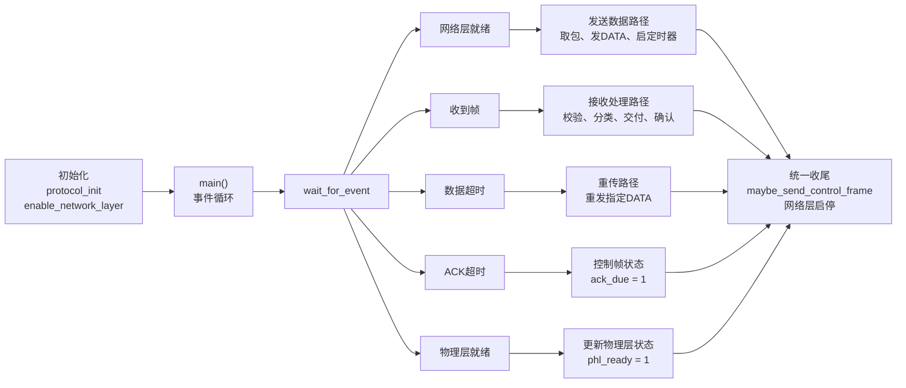

#### 2.6.2 发送方向调用关系

发送方向从 `NETWORK_LAYER_READY` 事件开始。当网络层有新分组可发送，并且发送窗口未满、物理层队列允许继续发送时，主循环调用 `get_packet()` 从网络层取出分组，将其保存到 `out_buf[next_frame_to_send % NR_BUFS]`。随后调用 `send_frame_kind(FRAME_DATA, next_frame_to_send)` 构造数据帧并发送。

`send_frame_kind()` 在发送 DATA 帧时会完成以下调用：

1. 调用 `current_ack()` 计算当前可以搭载的 ACK。
2. 从 `out_buf` 复制分组数据到 `struct FRAME`。
3. 调用 `put_frame()` 添加 CRC 并交给物理层。
4. 调用 `start_timer(frame_nr, DATA_TIMER)` 启动该序号对应的数据定时器。
5. 调用 `clear_ack_state()` 清理已经被本次发送搭载或发送出去的 ACK/NAK 状态。

如果后续收到 ACK，`handle_ack()` 会停止对应数据定时器并滑动发送窗口；如果收到 NAK 或数据定时器超时，则重新调用 `send_frame_kind(FRAME_DATA, resend)` 只重传对应序号的数据帧。

发送方向的主要调用关系如图 2-2 所示。

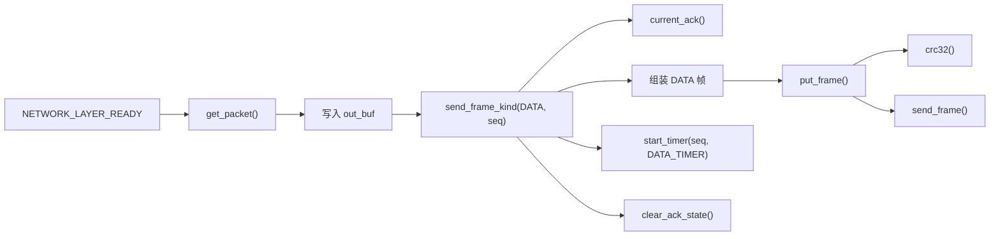

#### 2.6.3 接收方向调用关系

接收方向从 `FRAME_RECEIVED` 事件开始。主循环先调用 `recv_frame()` 取出物理层收到的帧，再调用 `crc32()` 检查帧校验结果。若帧长度不合法或 CRC 校验失败，则调用 `request_nak()` 请求对方重传当前期望帧，不把错误帧交付给网络层。

对于 CRC 正确的 DATA 帧，程序首先通过 `between(frame_expected, f.seq, too_far)` 判断该帧是否位于当前接收窗口内。若在窗口内，则根据是否为当前期望序号调用 `queue_ack()` 或 `request_nak()`，随后将新到达的数据复制到 `in_buf[f.seq % NR_BUFS]`，设置 `arrived` 标记，并调用 `deliver_frames()` 尝试按序交付。

`deliver_frames()` 会持续检查 `arrived[frame_expected % NR_BUFS]`。只要当前期望帧已经到达，就调用 `put_packet()` 将分组交给网络层，然后推进 `frame_expected` 和 `too_far`。当至少交付了一个数据帧后，函数会调用 `queue_ack()` 标记需要确认新的接收进度。

接收方向的主要调用关系如图 2-3 所示。

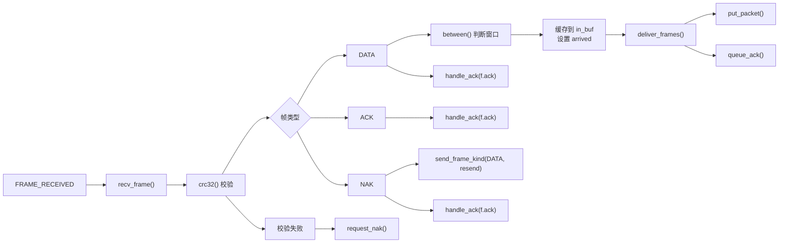

#### 2.6.4 ACK/NAK 与控制帧调用关系

ACK 和 NAK 控制流程贯穿发送和接收两个方向：

1. 正确收到 DATA 或完成连续交付后，调用 `queue_ack()` 登记 ACK。
2. 发现坏帧、缺失帧或失序缺口时，调用 `request_nak()` 登记 NAK。
3. 每轮事件处理结束后，主循环调用 `maybe_send_control_frame()`。
4. `maybe_send_control_frame()` 优先检查 `nak_pending`，若存在待发 NAK，则调用 `send_frame_kind(FRAME_NAK, 0)`。
5. 如果没有 NAK 且 ACK 定时器已经超时，则调用 `send_frame_kind(FRAME_ACK, 0)` 发送独立 ACK。
6. 如果后续有 DATA 帧可发，则 ACK 可以通过 `send_frame_kind(FRAME_DATA, seq)` 中的 `ack` 字段搭载发送。

这种调用关系使 ACK 既可以被 DATA 帧搭载，也可以在必要时独立发送；NAK 则具有更高优先级，用于尽快触发选择性重传。

ACK/NAK 控制帧的主要调用关系如图 2-4 所示。

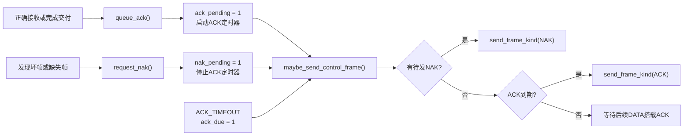

### 2.7 算法流程

本程序采用事件驱动方式实现选择重传协议。协议启动后，链路层不主动轮询网络层或物理层，而是调用实验库 `wait_for_event()` 等待事件发生。每次事件到达后，程序根据事件类型执行相应处理，并在事件处理结束时统一检查是否需要发送 ACK/NAK 控制帧以及是否允许网络层继续产生新分组。

从整体上看，主算法可以分为以下几个阶段：

1. 初始化协议运行环境，建立 A/B 两站连接。
2. 初始化发送窗口、接收窗口和接收缓存标记。
3. 启用网络层，使网络层可以在窗口未满时交付待发送分组。
4. 进入无限事件循环，等待网络层、物理层、收帧和定时器事件。
5. 根据事件类型分别处理新分组发送、收到帧、数据超时重传、ACK 超时和物理层就绪。
6. 每轮事件处理后，优先处理待发送 NAK，其次处理已到期的独立 ACK。
7. 根据发送窗口占用情况和物理层队列状态启用或关闭网络层。

主循环的伪代码如下：

```text
调用 protocol_init(argc, argv) 初始化实验环境
清空 arrived[] 接收标记数组
调用 enable_network_layer() 允许网络层送入分组

while true:
    event, arg = wait_for_event()

    if event == NETWORK_LAYER_READY:
        if 当前有 NAK 待发送且物理层允许发送:
            立即发送 NAK
        else:
            从网络层 get_packet() 取出一个分组
            将分组缓存到 out_buf[next_frame_to_send % NR_BUFS]
            nbuffered 加 1
            发送序号为 next_frame_to_send 的 DATA 帧
            next_frame_to_send 循环加 1

    else if event == PHYSICAL_LAYER_READY:
        标记 phl_ready = 1

    else if event == FRAME_RECEIVED:
        调用 recv_frame() 取出收到的帧
        if 帧长度过短或 CRC 校验失败:
            请求发送 NAK
        else:
            if 帧类型为 DATA:
                检查 DATA 帧长度
                若帧序号在接收窗口内:
                    若不是当前期望帧，登记 NAK
                    若是当前期望帧，登记 ACK
                    若该序号尚未缓存，则缓存数据并设置 arrived
                    调用 deliver_frames() 尝试按序交付
                若帧序号不在接收窗口内:
                    忽略该数据帧并登记 ACK
                处理 DATA 帧中搭载的 ACK

            else if 帧类型为 ACK:
                处理 ACK，滑动发送窗口

            else if 帧类型为 NAK:
                根据 NAK 中的确认号计算需要重传的序号
                若该序号仍位于发送窗口内，则重传对应 DATA 帧
                同时处理 NAK 帧中搭载的 ACK

            else:
                忽略未知类型帧

    else if event == DATA_TIMEOUT:
        重传 arg 指定序号的数据帧

    else if event == ACK_TIMEOUT:
        若存在待发送 ACK 且当前没有待发送 NAK:
            标记 ack_due = 1

    调用 maybe_send_control_frame()
        若有 NAK 待发，则优先发送 NAK
        否则若 ACK 已到期，则发送独立 ACK

    if nbuffered < NR_BUFS 且物理层允许继续发送:
        enable_network_layer()
    else:
        disable_network_layer()
```

该主流程体现了选择重传协议的几个关键原则：

1. **发送端滑动窗口控制**：只有 `nbuffered < NR_BUFS` 且物理层可继续排队时，才允许网络层继续交付新分组，避免发送窗口溢出。
2. **接收端窗口缓存**：收到窗口内的正确 DATA 帧后先缓存，再由 `deliver_frames()` 统一按序交付，保证不会向网络层乱序提交。
3. **选择性重传**：收到 NAK 或 DATA 定时器超时时，只重传对应序号的数据帧，不回退整个发送窗口。
4. **ACK 搭载与延迟 ACK**：DATA 帧发送时自动携带当前 ACK；若没有 DATA 可搭载，则 ACK 定时器到期后发送独立 ACK。
5. **错误帧不进入上层**：CRC 校验失败或长度不合法的帧不会提交给网络层，只触发 NAK 请求或被忽略。

### 2.8 发送端处理流程

发送端负责从网络层获取分组、缓存分组、封装 DATA 帧、维护发送窗口并根据 ACK 推进窗口。当前实现中，发送端逻辑主要由 `NETWORK_LAYER_READY` 事件、`send_frame_kind()` 和 `handle_ack()` 共同完成。

发送端处理步骤如下：

1. 主循环在每轮事件结束时判断 `nbuffered < NR_BUFS` 且 `can_queue_frame()` 为真时，调用 `enable_network_layer()`，允许网络层继续产生新分组。
2. 当实验库产生 `NETWORK_LAYER_READY` 事件时，说明网络层有新分组可以发送。
3. 若此时存在待发送 NAK 且物理层允许发送，则优先发送 NAK，避免控制帧被新 DATA 帧延迟。
4. 若没有需要优先发送的 NAK，则调用 `get_packet()` 从网络层取出一个长度为 `PKT_LEN` 的分组。
5. 将分组保存到 `out_buf[next_frame_to_send % NR_BUFS]`，使后续超时或 NAK 触发时可以重新发送。
6. 将 `nbuffered` 加 1，表示发送窗口中未确认帧数量增加。
7. 调用 `send_frame_kind(FRAME_DATA, next_frame_to_send)` 发送 DATA 帧。
8. `send_frame_kind()` 在 DATA 帧中填写 `kind`、`seq`、`ack` 和 `data` 字段，其中 `ack` 字段由 `current_ack()` 计算，用于搭载接收方向的确认信息。
9. DATA 帧通过 `put_frame()` 添加 CRC 并交给物理层发送，同时启动该序号对应的数据定时器。
10. 发送完成后，`next_frame_to_send` 通过 `inc_seq()` 在循环序号空间内前进。
11. 后续收到 ACK 时，调用 `handle_ack()` 停止已确认帧的定时器，减少 `nbuffered`，并推进发送窗口左边界 `ack_expected`。

发送端流程如图 2-5 所示。

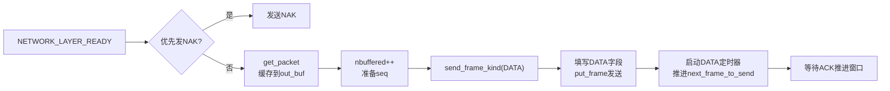

发送窗口推进流程如图 2-6 所示。

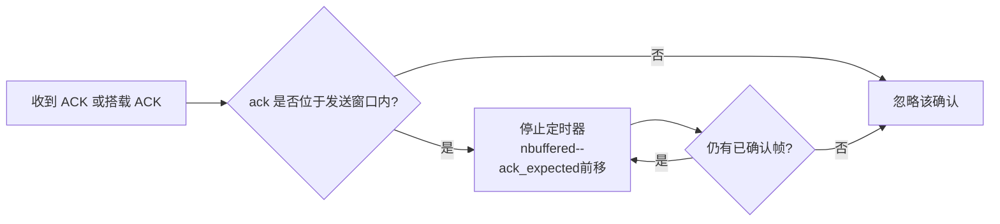

该流程保证发送端始终只在窗口允许范围内接收网络层新分组，并能在收到确认后及时释放发送缓存和定时器资源。由于 ACK 处理使用 `between()` 判断循环窗口，序号从 `15` 回绕到 `0` 时仍能正确滑动。

### 2.9 接收端处理流程

接收端负责接收物理层提交的帧、检查 CRC、判断帧是否位于接收窗口内、缓存失序帧，并按序向网络层交付数据。当前实现中，接收端逻辑主要在 `FRAME_RECEIVED` 事件和 `deliver_frames()` 中完成。

接收端处理步骤如下：

1. 当实验库产生 `FRAME_RECEIVED` 事件时，主循环调用 `recv_frame()` 取出收到的帧。
2. 程序先检查帧长度是否至少达到控制帧长度，并调用 `crc32()` 进行 CRC 校验。
3. 如果 CRC 校验失败或帧过短，则认为该帧不可用，调用 `request_nak()` 请求对方重传当前期望帧，不向网络层交付任何数据。
4. 若收到的是 DATA 帧，则先检查帧长度是否等于 `DATA_FRAME_LEN`。
5. 对长度和 CRC 均正确的 DATA 帧，调用 `between(frame_expected, f.seq, too_far)` 判断其序号是否位于当前接收窗口内。
6. 若 DATA 帧在接收窗口外，说明该帧可能是重复帧或旧帧，程序忽略其数据内容，并调用 `queue_ack()` 重新确认当前连续接收进度。
7. 若 DATA 帧在接收窗口内，但 `f.seq != frame_expected`，说明当前期望帧之前存在缺口，程序调用 `request_nak()` 请求缺失帧重传。
8. 若 DATA 帧正好是当前期望帧，则调用 `queue_ack()` 登记 ACK。
9. 如果该序号对应缓存位置尚未标记为已到达，则将数据复制到 `in_buf[f.seq % NR_BUFS]`，并设置 `arrived[f.seq % NR_BUFS] = 1`。
10. 调用 `deliver_frames()` 检查从 `frame_expected` 开始是否有连续到达的数据帧。
11. `deliver_frames()` 每成功交付一个分组，就调用 `put_packet()` 提交给网络层，并推进 `frame_expected` 和 `too_far`。
12. 只要缓存中下一个期望帧仍然已经到达，`deliver_frames()` 会继续交付，直到遇到缺失帧为止。

接收端处理流程如图 2-7 所示。

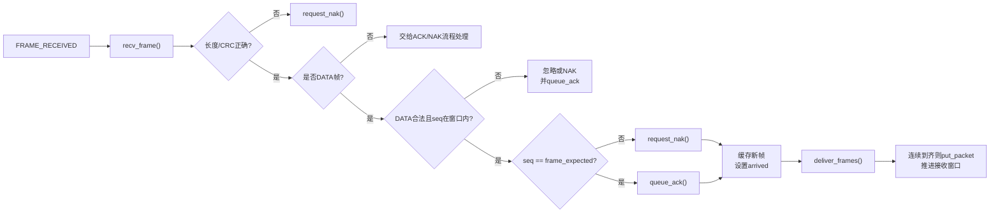

按序交付流程如图 2-8 所示。

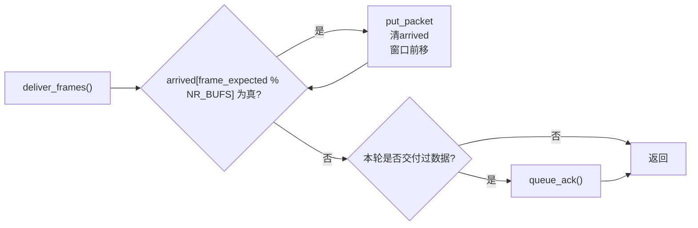

该流程体现了 SR 协议接收端的核心特点：窗口内失序帧可以先缓存，但只有从 `frame_expected` 开始连续到齐的数据才会交付给网络层。这样既提高了误码条件下的恢复效率，又保证了网络层收到的数据严格按序。

### 2.10 ACK、NAK 与重传处理流程

ACK、NAK 和重传机制用于保证协议在误码、丢帧或 ACK 丢失情况下仍能继续推进。当前实现中，ACK 既可以搭载在 DATA 帧中，也可以在 ACK 定时器超时后单独发送；NAK 用于请求对方尽快重传当前缺失的数据帧；DATA 定时器则作为最终的超时恢复机制。

#### 2.10.1 ACK 处理流程

ACK 的产生和发送流程如下：

1. 接收端收到正确 DATA 帧，或者 `deliver_frames()` 完成连续交付后，调用 `queue_ack()`。
2. `queue_ack()` 设置 `ack_pending = 1`，表示当前有 ACK 需要发送。
3. 若当前没有待发送 NAK，且 ACK 尚未到期，则启动 ACK 搭载定时器。
4. 如果之后本端有 DATA 帧要发送，则 `send_frame_kind(FRAME_DATA, seq)` 会在 DATA 帧的 `ack` 字段中搭载当前 ACK。
5. 如果 ACK 定时器超时且仍没有 DATA 帧可搭载，则 `ACK_TIMEOUT` 事件将 `ack_due` 置为 1。
6. 事件循环末尾调用 `maybe_send_control_frame()`，当发现 `ack_due = 1` 且没有待发送 NAK 时，发送独立 ACK 帧。

ACK 发送流程如图 2-9 所示。

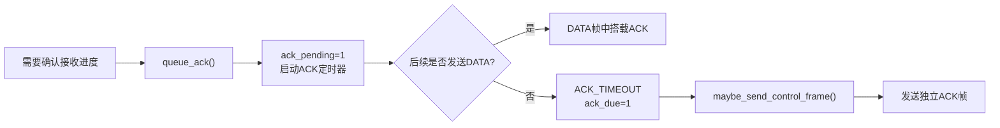

#### 2.10.2 NAK 处理流程

NAK 的产生和处理流程如下：

1. 接收端发现坏帧、CRC 校验失败、DATA 帧长度不合法，或收到窗口内但不是当前期望序号的数据帧时，调用 `request_nak()`。
2. `request_nak()` 通过 `no_nak` 判断当前缺失帧是否已经请求过 NAK，避免重复发送大量 NAK。
3. 若允许发送 NAK，则设置 `nak_pending = 1`，并停止 ACK 定时器。
4. 每轮事件处理结束时，`maybe_send_control_frame()` 会优先检查 `nak_pending`。
5. 若存在待发 NAK 且物理层允许发送，则调用 `send_frame_kind(FRAME_NAK, 0)` 发送 NAK。
6. 发送端收到 NAK 后，根据 NAK 中的 `ack` 字段计算需要重传的序号 `inc_seq(f.ack)`。
7. 若该序号仍位于当前发送窗口内，则调用 `send_frame_kind(FRAME_DATA, resend)` 重传对应数据帧。

NAK 处理流程如图 2-10 所示。

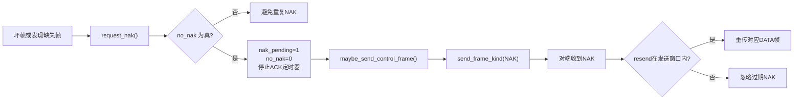

#### 2.10.3 DATA 超时重传流程

每个已发送但未确认的 DATA 帧都有独立数据定时器。发送 DATA 帧时，程序以该帧序号作为定时器编号调用 `start_timer(frame_nr, DATA_TIMER)`。如果该帧在定时器到期前被 ACK 确认，`handle_ack()` 会调用 `stop_timer(ack_expected)` 停止对应定时器。若定时器到期，则实验库产生 `DATA_TIMEOUT` 事件，`arg` 中保存超时定时器编号，即需要重传的数据帧序号。

DATA 超时处理步骤如下：

1. 发送 DATA 帧时启动该序号对应的数据定时器。
2. 收到 ACK 后，若该帧被确认，则停止对应定时器。
3. 若定时器先到期，实验库产生 `DATA_TIMEOUT` 事件。
4. 主循环收到 `DATA_TIMEOUT` 后，调用 `send_frame_kind(FRAME_DATA, arg)` 重传对应序号的数据帧。
5. 重传时仍从 `out_buf[arg % NR_BUFS]` 中复制原始分组，并重新启动该序号的数据定时器。

DATA 超时重传流程如图 2-11 所示。

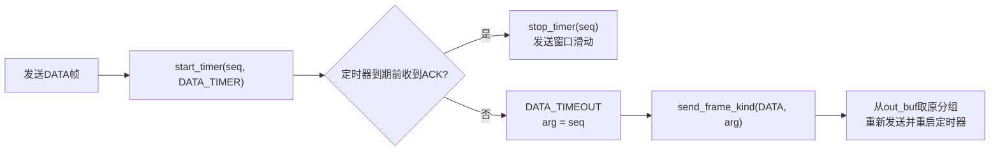

该机制体现了选择重传协议的特点：无论是收到 NAK 还是 DATA 定时器超时，发送端都只重传对应序号的数据帧，不重传整个窗口中的所有帧。因此在误码信道下，相比 Go-Back-N 可以减少不必要的重传，提高有效线路利用率。

### 2.11 流程图

本节对前文给出的流程图进行汇总说明。由于选择重传协议同时包含发送窗口、接收窗口、ACK/NAK 和超时重传等多个逻辑分支，如果将全部细节放在同一张图中，会导致图形过大、排版困难且阅读不清晰。因此本报告采用“总体图 + 子流程图”的方式组织流程图。

各流程图与说明内容的对应关系如下：

| 图号 | 图名 | 对应内容 | 作用 |
| --- | --- | --- | --- |
| 图 2-1 | 总体调用关系图 | `main()` 事件循环与各类事件分支 | 展示程序整体事件驱动结构 |
| 图 2-2 | 发送方向调用关系图 | `NETWORK_LAYER_READY` 到 DATA 帧发送 | 展示取包、缓存、封装和发送调用链 |
| 图 2-3 | 接收方向调用关系图 | `FRAME_RECEIVED` 后的帧分类与处理 | 展示收帧、校验、分类、缓存和交付入口 |
| 图 2-4 | ACK/NAK 控制帧调用关系图 | ACK/NAK 状态登记与控制帧发送 | 展示 ACK 搭载、独立 ACK 和 NAK 优先级 |
| 图 2-5 | 发送端处理流程图 | 网络层分组进入发送窗口并发送 DATA | 描述发送端主流程 |
| 图 2-6 | 发送窗口推进流程图 | 收到 ACK 后发送窗口滑动 | 描述 ACK 如何释放发送窗口 |
| 图 2-7 | 接收端处理流程图 | DATA 帧进入接收窗口与缓存 | 描述接收端判断和缓存流程 |
| 图 2-8 | 按序交付流程图 | `deliver_frames()` 连续交付 | 描述失序缓存如何最终按序上交 |
| 图 2-9 | ACK 发送流程图 | ACK 登记、搭载和独立发送 | 描述延迟 ACK 与 ACK 搭载机制 |
| 图 2-10 | NAK 处理流程图 | 缺失帧请求与选择性重传 | 描述 NAK 如何触发单帧重传 |
| 图 2-11 | DATA 超时重传流程图 | DATA 定时器到期后的重传 | 描述超时兜底恢复机制 |

最终整理实验报告时，建议保留图 2-1、图 2-5、图 2-7、图 2-9、图 2-10 和图 2-11 作为正文插图。图 2-2、图 2-3 和图 2-4 更偏向模块调用关系说明，可以根据版面情况保留在“模块调用关系”部分，或者作为辅助图放在附录或报告草稿中。

这些流程图共同说明了当前 SR 协议实现的完整工作过程：

1. 发送端通过窗口控制限制未确认帧数量，并为每个 DATA 帧启动独立定时器。
2. 接收端使用接收窗口和缓存数组保存窗口内正确到达的数据帧。
3. 只有从 `frame_expected` 开始连续到达的数据才会被交付给网络层。
4. ACK 可以被 DATA 帧搭载，也可以在 ACK 定时器超时后独立发送。
5. NAK 和 DATA timeout 都只触发对应序号的数据帧重传，体现选择重传协议的选择性恢复特点。

因此，第 2 节的软件设计既从数据结构、模块调用关系说明了程序静态结构，也通过流程图说明了程序在运行时如何完成可靠传输。

---

## 3. 实验结果分析

### 3.1 有误码信道下无差错传输功能

本节验证选择重传协议是否能够在默认有误码信道下实现无差错传输。这里的“无差错传输”不是指物理信道中不发生错误，而是指在物理信道存在误码时，链路层能够检测错误帧、丢弃错误帧，并通过 ACK、NAK 和超时重传机制恢复传输，最终保证交付给网络层的分组内容正确、顺序正确。

实验库中的 `put_packet()` 会检查链路层交付给网络层的分组长度、内容和顺序。如果链路层交付了错误分组、重复分组或乱序分组，程序会输出 `Network Layer received a bad packet from data link layer`、`Bad Packet length` 等错误并中止。因此，程序能够持续输出 `packets received` 统计信息并正常退出，同时不出现网络层错误，可以作为链路层无差错交付的重要证据。

早期曾进行两组 3 分钟功能基线测试，分别覆盖默认误码率下的普通发送场景和洪水发送场景。后续参数优化只调整 `DATA_TIMER` 和 `MAX_PHL_BACKLOG`，不改变 CRC 校验、窗口判断、ACK/NAK 和选择性重传等正确性机制。为避免旧参数日志与最终参数结果混淆，旧日志已经清理；`docs/测试记录/3.1-有误码无差错传输/` 目录中保留 `最终参数日志索引.md`，指向最终参数下的正式长测日志。

测试通过标准如下：

1. A/B 两站在测试时间内持续输出 `packets received` 统计信息。
2. 程序能够正常运行到 `-t` 指定时间并退出。
3. 日志中不出现 `FATAL`、`Abort`、`Network Layer received a bad packet`、`Bad Packet length` 或发送队列溢出。
4. 即使出现 CRC 错误、NAK 或 DATA timeout，协议仍能恢复并继续传输。

最终参数下的正式测试结果摘要如下：

| 测试场景 | 参数组合 | 时长 | A 最后利用率 | B 最后利用率 | 平均利用率 | 是否出现网络层坏包 | 是否正常退出 | 结论 |
| --- | --- | ---: | ---: | ---: | ---: | --- | --- | --- |
| 默认误码洪水发送，首次长测 | `DATA_TIMER=2200 ms`，`MAX_PHL_BACKLOG=3 * DATA帧长度` | 1200 s | `86.10%` | `86.48%` | `86.29%` | 否 | 是 | 通过 |
| 默认误码洪水发送，邻域复测 | `DATA_TIMER=2200 ms`，`MAX_PHL_BACKLOG=3 * DATA帧长度` | 1200 s | `86.41%` | `86.40%` | `86.40%` | 否 | 是 | 通过 |

在最终参数邻域复测中，A 站最后一次统计为 `4044 packets received, 6912 bps, 86.41%, Err 92 (1.0e-05)`，B 站最后一次统计为 `4042 packets received, 6912 bps, 86.40%, Err 92 (1.0e-05)`。两端都持续接收分组并正常退出，说明在双向持续发送且存在误码的情况下，协议仍能保持正常传输。

从日志事件看，两轮最终参数长测中均出现 CRC 错误相关日志、NAK 和 DATA timeout，说明测试过程中确实触发了误码检测和重传恢复路径。其中，最终参数首次长测统计到 `Send NAK` 共 `148` 次、`DATA timeout` 共 `264` 次、CRC 错误相关日志共 `153` 次；最终参数邻域复测统计到 `Send NAK` 共 `148` 次、`DATA timeout` 共 `252` 次、CRC 错误相关日志共 `157` 次。尽管存在这些错误恢复事件，程序仍持续输出接收统计并正常退出，没有出现网络层坏包错误。

结合协议机制分析，当前实现能够实现有误码信道下无差错传输的原因主要包括：

1. 所有收到的帧先进行 CRC-32 校验，校验失败的帧不会交付给网络层。
2. 接收端只缓存接收窗口内的正确 DATA 帧，窗口外重复帧或旧帧不会被重复交付。
3. `deliver_frames()` 只从 `frame_expected` 开始连续交付，保证网络层收到的分组按序。
4. 发现缺失帧或错误帧后，接收端通过 NAK 请求对方尽快重传。
5. 如果 ACK 或 NAK 丢失，发送端的数据帧定时器仍会触发对应序号的超时重传。

因此，根据早期功能基线验证以及本节列出的两轮最终参数长测结果，可以确认：当前选择重传协议实现能够在默认误码率 `1.0E-5` 的信道环境下实现无差错传输。更长时间运行的稳定性将在第 3.2 节继续分析，详细测试日志和数据记录将在第 3.8 节统一整理。

### 3.2 程序健壮性与长时间运行能力

本节验证程序在较长时间运行时是否能够保持稳定，重点关注是否出现死锁、长期停滞、异常退出、发送队列溢出或网络层坏包。根据实验指导书要求，协议软件正常工作的标志不是进程仍然存在，而是在网络层持续发送分组时，接收端能够持续成功接收分组，并周期性输出 `packets received` 统计信息。

为验证程序健壮性，本节采用默认误码率 `1.0E-5` 下的双向洪水发送场景进行 20 分钟长测。该场景下 A/B 两站网络层持续产生分组，链路层会持续面对 DATA 帧发送、ACK/NAK、CRC 错误和超时重传等事件，因此比普通短测更能暴露窗口推进、定时器和错误恢复方面的问题。

在参数优化前，曾使用 `DATA_TIMER = 1500 ms`、`MAX_PHL_BACKLOG = 8 * FRAME_WIRE_BYTES(DATA_FRAME_LEN)` 进行 20 分钟基线长测。该组测试能够证明协议不会死锁或错误交付，但平均利用率为 `75.56%`，`DATA timeout` 总数为 `1203` 次，性能不是最终结论。根据后续参数优化结果，本节以最终参数 `DATA_TIMER = 2200 ms`、`MAX_PHL_BACKLOG = 3 * FRAME_WIRE_BYTES(DATA_FRAME_LEN)` 的 20 分钟复测作为当前实现的长时间运行能力依据。

测试命令如下：

```powershell
.\Debug\datalink.exe -f -d7 -t 1200 -p 60031 -l docs\测试记录\参数优化-DATA_TIMER-MAX_PHL_BACKLOG\06-DATA_TIMER邻域20min\dt2200-bg3-neighborhood-20min-20260509-235338-A.log A
.\Debug\datalink.exe -f -d7 -t 1200 -p 60031 -l docs\测试记录\参数优化-DATA_TIMER-MAX_PHL_BACKLOG\06-DATA_TIMER邻域20min\dt2200-bg3-neighborhood-20min-20260509-235338-B.log B
```

测试通过标准如下：

1. A/B 两站能够运行到 `-t 1200` 指定时间并正常退出。
2. A/B 两站持续输出 `packets received` 统计信息，未出现长时间停滞。
3. 日志中不出现 `FATAL`、`Abort`、`Network Layer received a bad packet`、`Bad Packet length` 或发送队列溢出。
4. 出现 CRC 错误、NAK 和 DATA timeout 后，协议仍能恢复并继续传输。

长时间运行测试结果如下：

| 站点 | 是否正常退出 | 最后统计时间 | 接收分组数 | bps | 利用率 | 误码统计 | 统计行数量 | 最大统计间隔 |
| --- | --- | ---: | ---: | ---: | ---: | --- | ---: | ---: |
| A | 是 | `1198.444 s` | `4044` | `6912` | `86.41%` | `Err 92 (1.0e-05)` | `525` | `4.250 s` |
| B | 是 | `1197.978 s` | `4042` | `6912` | `86.40%` | `Err 92 (1.0e-05)` | `524` | `4.258 s` |

本次长测的平均最后利用率为：

```text
(86.41% + 86.40%) / 2 = 86.40%
```

从测试结果看，A/B 两站均运行到接近 1200 秒并正常输出 `Quit.`，没有被测试脚本强制结束。两站在整个过程中持续输出接收统计，统计行数量分别为 `525` 和 `524`，最大相邻统计间隔分别为 `4.250 s` 和 `4.258 s`，未观察到长期没有接收统计的停滞现象。

日志事件统计如下：

| 站点 | `Send DATA` | `Recv DATA` | `Send ACK` | `Send NAK` | `ACK timeout` | `DATA timeout` | CRC 错误相关日志 | 异常错误 |
| --- | ---: | ---: | ---: | ---: | ---: | ---: | ---: | --- |
| A | `4337` | `4164` | `945` | `72` | `946` | `132` | `77` | 无 |
| B | `4318` | `4177` | `923` | `76` | `924` | `120` | `80` | 无 |

可以看到，在 20 分钟运行过程中，CRC 错误、NAK 和 DATA timeout 持续出现，说明测试确实覆盖了有误码信道下的错误恢复路径。尽管存在错误恢复事件，程序没有出现网络层坏包、异常中止或发送队列溢出，A/B 两端仍能持续交付数据。

为避免把优化前基线误认为最终性能，本节同时保留参数优化前后的对比结果：

| 参数组合 | 测试性质 | 平均利用率 | `DATA timeout` 总数 | 结论 |
| --- | --- | ---: | ---: | --- |
| `DATA_TIMER = 1500 ms`，`MAX_PHL_BACKLOG = 8 * DATA帧长度` | 优化前基线长测 | `75.56%` | `1203` | 能稳定运行，但误触发超时较多 |
| `DATA_TIMER = 2200 ms`，`MAX_PHL_BACKLOG = 3 * DATA帧长度` | 最终参数首次长测 | `86.29%` | `264` | 稳定运行，利用率显著提升 |
| `DATA_TIMER = 2200 ms`，`MAX_PHL_BACKLOG = 3 * DATA帧长度` | 最终参数复测 | `86.40%` | `252` | 结果稳定，可作为当前实现的长测结论 |

因此，可以确认当前最终参数下的协议实现具备较好的健壮性和长时间运行能力。在默认误码率和双向持续发送压力下，协议能够运行 20 分钟并正常退出，未观察到死锁、长期停滞或错误交付；相比优化前基线，最终参数还显著降低了无效 DATA timeout 数量，提高了长期线路利用率。后续若进行更高误码率测试，可进一步评估协议在更恶劣信道条件下的恢复能力和性能下降情况。

### 3.3 协议参数选取

本实现采用的关键参数如下表所示。需要说明的是，`MAX_SEQ`、`NR_BUFS`、`DATA_TIMER`、`ACK_TIMER` 和 `MAX_PHL_BACKLOG` 并不是实验指导书固定指定的常量，而是根据 SR 协议约束、链路条件和测试结果综合选取的实现参数。

| 参数 | 最终取值 | 选取说明 |
| --- | --- | --- |
| `MAX_SEQ` | `15` | 序号空间为 `0~15`，共 `16` 个序号 |
| `NR_BUFS` | `8` | 发送窗口、接收窗口及缓存大小 |
| `DATA_TIMER` | `2200 ms` | 数据帧重传定时器 |
| `ACK_TIMER` | `120 ms` | ACK 搭载等待定时器 |
| `MAX_PHL_BACKLOG` | `3 * FRAME_WIRE_BYTES(DATA_FRAME_LEN)` | 物理层发送队列积压控制阈值 |

`MAX_SEQ = 15` 与 `NR_BUFS = 8` 的组合满足选择重传协议的基本正确性要求，即发送窗口与接收窗口大小不超过序号空间的一半，能够避免序号回绕后新旧帧混淆。结合本实验 8000 bps、单向传播时延 270 ms、网络层分组长度 256 字节的链路条件，`NR_BUFS = 8` 既能明显优于停等式发送，又不会把窗口扩大到增加过多实现复杂度的程度。相关的窗口合理性分析和阶段性测试判断，已在成员 B 的参数判断记录和后续正式测试中得到支持。

早期测试曾在 `1200 ms`、`1500 ms` 和 `1800 ms` 中比较数据重传定时器，短测结果显示 `1500 ms` 可稳定运行且性能较好。但在后续 20 分钟默认误码洪水长测中，`DATA_TIMER = 1500 ms` 配合原先 `MAX_PHL_BACKLOG = 8 * FRAME_WIRE_BYTES(DATA_FRAME_LEN)` 时平均利用率为 `75.56%`，`DATA timeout` 总数达到 `1203` 次，说明物理层发送队列积压会拉长实际 ACK 返回时间，使数据定时器发生较多不必要超时。

因此，后续进一步把 `DATA_TIMER` 与 `MAX_PHL_BACKLOG` 联合优化。测试范围包括 `DATA_TIMER = 1500 / 2200 / 2600 / 3000 ms`，以及 `MAX_PHL_BACKLOG = 3 / 4 / 6 / 8` 个 DATA 帧长度。粗筛、复筛、无误码检查、10 分钟确认和 20 分钟长测后，`DATA_TIMER = 2200 ms`、`MAX_PHL_BACKLOG = 3 * FRAME_WIRE_BYTES(DATA_FRAME_LEN)` 的综合表现最好。该组合在 20 分钟默认误码洪水测试中平均利用率达到 `86.29%`，`DATA timeout` 为 `264` 次，相比原先 `1500 ms / 8` 的基线利用率提升 `10.73` 个百分点，超时次数减少 `939` 次。

为了排除偶然波动，又固定 `MAX_PHL_BACKLOG = 3 * FRAME_WIRE_BYTES(DATA_FRAME_LEN)`，补测 `DATA_TIMER = 2000 / 2200 / 2400 ms` 三组 20 分钟长测。结果显示，`2200 ms` 的平均利用率为 `86.40%`，高于 `2000 ms` 的 `85.89%` 和 `2400 ms` 的 `85.71%`；同时 `DATA timeout` 为 `252` 次，低于 `2000 ms` 的 `347` 次。虽然 `2400 ms` 的超时次数进一步降至 `185` 次，但利用率同步下降，说明定时器过长会降低错误恢复及时性。综合吞吐率和超时次数后，本实现最终采用 `DATA_TIMER = 2200 ms`。

`MAX_PHL_BACKLOG` 的调整不改变 SR 协议窗口大小。`NR_BUFS = 8` 仍然表示发送窗口和接收窗口最多容纳 8 个数据帧，而 `MAX_PHL_BACKLOG = 3 * FRAME_WIRE_BYTES(DATA_FRAME_LEN)` 只限制链路层向实验库物理层发送队列中提前排入的数据量。将该阈值从 8 个 DATA 帧长度收紧为 3 个 DATA 帧长度，可以减少慢速 8000 bps 物理层中的排队延迟，使 ACK、NAK 和重传帧更及时进入发送队列，从而降低无效超时重传并提升长期利用率。

`ACK_TIMER = 120 ms` 则是在多轮短测和 ACK 专项 20 分钟长测后保留下来的默认值。需要说明的是，ACK 专项 20 分钟长测发生在 `DATA_TIMER` 和 `MAX_PHL_BACKLOG` 联合优化之前，其利用率数值只用于比较 `120 ms` 与 `200 ms` 的相对表现，不作为最终参数下的性能结论。该组测试表明，`ACK_TIMER = 200 ms` 虽然能够减少独立 ACK，但平均利用率从 `75.56%` 降到 `74.41%`，且 `DATA timeout` 次数反而增加，因此不宜替代 `120 ms`。后续最终参数 20 分钟长测仍采用 `ACK_TIMER = 120 ms`，平均利用率达到 `86.29%` 和 `86.40%`。综合看，`120 ms` 仍然是反馈较及时、风险较低、且更适合当前实现的保守选择。

因此，当前实现最终采用的参数组合是：`MAX_SEQ = 15`、`NR_BUFS = 8`、`DATA_TIMER = 2200 ms`、`ACK_TIMER = 120 ms`、`MAX_PHL_BACKLOG = 3 * FRAME_WIRE_BYTES(DATA_FRAME_LEN)`。这组参数既满足 SR 协议的正确性约束，也在当前链路条件和长时间测试中表现出更好的吞吐率与稳定性。

### 3.4 理论分析

本节讨论协议在理想条件下的理论最大利用率。这里的“利用率”按网络层有效载荷吞吐率与信道速率之比计算，即网络层真正收到的数据量占 8000 bps 信道能力的比例。

先给出理论推导所采用的假设：

1. 无误码场景下，信道中不发生比特差错，DATA 帧、ACK 帧和 NAK 帧都能正常到达。
2. 理想情况下，ACK 尽量通过 DATA 帧搭载发送，不额外占用独立控制帧带宽。
3. 当前协议采用 `NR_BUFS = 8`，窗口大小足以覆盖该链路的传播等待，不构成理论上限的主要瓶颈。
4. 一帧 DATA 的有效载荷为 `PKT_LEN = 256` 字节，DATA 帧总长度为 `DATA_FRAME_LEN = 263` 字节，其中包含 3 字节头部和 4 字节 CRC。

#### 3.4.1 无误码信道下的理论最大利用率

在无误码条件下，若发送端能够持续保持窗口滑动、ACK 又都能够搭载在 DATA 帧中，则信道上的主要开销就是 DATA 帧自身的协议头和 CRC。单个 DATA 帧中真正有用的载荷占比为：

```text
U0 = 256 / 263
   ≈ 0.9734
   ≈ 97.34%
```

结合链路参数，单向传播时延为 `270 ms`，数据帧发送时间约为 `263 ms`。往返传播等待折算成在途数据量大约是：

```text
8000 bps × 0.54 s = 4320 bit ≈ 540 byte
```

而单个 DATA 帧约为 `263 byte`，因此该链路只需要少量在途帧就能覆盖传播等待。当前实现的窗口大小为 `8`，明显大于覆盖该链路所需的在途帧数，所以窗口不会成为理论利用率上限的主要限制因素。也就是说，在无误码且 ACK 全部可搭载的理想情况下，本协议的理论最大利用率可以近似看作：

```text
Umax_no_error ≈ 97.34%
```

#### 3.4.2 有误码信道下的理论最大利用率

在有误码信道下，若仍假设采用理想的选择重传策略，即只重传出错的 DATA 帧，并且 ACK/NAK 仍尽量搭载或以最小开销发送，则主要损失来自 DATA 帧重传。设 BER 为 `p = 1.0E-5`，DATA 帧长度为 `263 × 8 = 2104 bit`，则一个 DATA 帧无差错到达的概率近似为：

```text
Ps = (1 - p)^2104
   ≈ (1 - 1.0E-5)^2104
   ≈ 0.979
```

因此，理想情况下每成功交付一个 DATA 帧，平均需要付出的发送代价约为 `1 / Ps`。于是有误码信道下的理论最大利用率可近似写为：

```text
Umax_error ≈ U0 × Ps
          ≈ 97.34% × 97.9%
          ≈ 95.3%
```

这个结果表示：在误码率为 `1.0E-5` 的理想选择重传条件下，协议仍然可以保持较高的有效载荷吞吐率，但会因为少量重传而低于无误码上限。由于控制帧很短、且理想情况下 ACK 仍尽量搭载，因此这里把控制帧的额外损耗视为次要项。实际运行结果通常会低于这个理论上限，原因会在下一节结合测试数据进一步说明。

### 3.5 实际运行效率与理论对比

第 3.4 节给出了理想条件下的理论估计：无误码信道下，由于 DATA 帧有效载荷为 256 字节、帧总长度为 263 字节，理论最大有效载荷利用率约为 `97.34%`；默认误码率 `1.0E-5` 下，考虑 DATA 帧出错后需要重传，有误码信道的理想最大利用率约为 `95.3%`。本节将这些理论值与实际测试结果进行对比。

实测数据选取两个层次：一是无误码洪水短测，用于观察协议在接近理想信道时能否接近理论上限；二是默认误码率下的 20 分钟最终参数长测，用于评价真实实验条件下的长期运行效率。对比结果如下：

| 测试场景 | 测试依据 | 实测平均利用率 | 对应理论利用率 | 与理论差距 | 达到理论值比例 |
| --- | --- | ---: | ---: | ---: | ---: |
| 无误码洪水发送 | `DATA_TIMER=2200 ms`、`MAX_PHL_BACKLOG=3 * DATA帧长度`，2 分钟检查 | `95.93%` | `97.34%` | `1.41` 个百分点 | `98.6%` |
| 默认误码洪水发送，首次长测 | 最终参数 20 分钟长测 | `86.29%` | `95.3%` | `9.01` 个百分点 | `90.5%` |
| 默认误码洪水发送，邻域复测 | 最终参数 20 分钟复测 | `86.40%` | `95.3%` | `8.90` 个百分点 | `90.7%` |

从无误码测试看，实测平均利用率 `95.93%` 已经接近理论最大值 `97.34%`。这说明在没有误码干扰时，当前窗口大小、ACK 搭载机制和物理层排队控制基本能够让发送端持续向链路注入数据，协议头部和 CRC 以外的额外损耗较小。实测值仍低于理论值，主要原因是理论推导假设 ACK 完全搭载、发送过程连续无间隙，而实际程序中仍存在事件调度、ACK timeout、进程同步和实验库物理层队列管理等开销。

从默认误码长测看，最终参数下两轮 20 分钟测试的平均利用率分别为 `86.29%` 和 `86.40%`，约达到有误码理论上限的 `90%` 以上。该结果明显低于理想的 `95.3%`，但仍处于合理范围。理论推导只把 DATA 帧随机出错造成的重传作为主要损耗，并假设 ACK/NAK 开销很小、错误恢复能够立即发生；实际运行时，误码可能影响 DATA、ACK 或 NAK 帧，错误帧会触发 NAK、DATA timeout 和选择性重传，这些控制帧和重传帧都会占用 8000 bps 的低速链路。

此外，本实现将 `MAX_PHL_BACKLOG` 收紧为 3 个 DATA 帧长度，是为了避免物理层队列过长导致 ACK、NAK 和重传帧被大量已排队 DATA 帧阻塞。该设置显著减少了无效超时并提高了长期利用率，但也意味着程序不会无条件把物理层发送队列填得很深。在默认误码长测中，这种设计更偏向稳定、及时恢复和避免队列积压，而不是追求理论上完全连续的发送状态，因此实测利用率低于理想上限是可以解释的。

综合比较可以得到以下结论：当前 SR 实现的性能瓶颈并不主要来自窗口大小。窗口 `NR_BUFS = 8` 已足以覆盖本实验链路的传播等待，无误码测试也证明协议能够接近理论上限。默认误码场景下的效率下降主要来自实际错误恢复开销、独立 ACK/NAK 控制帧、DATA timeout 触发、物理层排队延迟和 Windows 下事件调度误差。经过参数优化后，最终参数将默认误码 20 分钟长测平均利用率稳定在约 `86.3%~86.4%`，相比优化前 `75.56%` 的基线有明显提升，说明当前参数选择能够在正确性、稳定性和线路利用率之间取得较好的平衡。

### 3.6 性能测试记录表

本节汇总实验过程中用于支撑性能分析和参数选择的主要测试记录。表中“异常”主要指是否出现 `FATAL`、`Abort`、`Network Layer received a bad packet`、`Bad Packet length` 或物理层发送队列溢出等会影响协议正确性的现象。更完整的日志路径和原始输出将在第 3.8 节统一列出。

#### 3.6.1 最终参数下的主要性能记录

最终实现采用的参数为：`DATA_TIMER = 2200 ms`、`ACK_TIMER = 120 ms`、`MAX_PHL_BACKLOG = 3 * FRAME_WIRE_BYTES(DATA_FRAME_LEN)`、`NR_BUFS = 8`。在该参数组合下，主要性能测试结果如下：

| 编号 | 测试场景 | 时长 | A 利用率 | B 利用率 | 平均利用率 | `DATA timeout` | NAK | CRC 错误相关日志 | 异常 | 结论 |
| --- | --- | ---: | ---: | ---: | ---: | ---: | ---: | ---: | --- | --- |
| T1 | 无误码洪水发送 | 120 s | `95.92%` | `95.93%` | `95.93%` | `0` | `0` | `0` | 无 | 接近无误码理论上限 |
| T2 | 默认误码洪水发送，首次长测 | 1200 s | `86.10%` | `86.48%` | `86.29%` | `264` | `148` | `153` | 无 | 稳定运行 20 分钟 |
| T3 | 默认误码洪水发送，邻域复测 | 1200 s | `86.41%` | `86.40%` | `86.40%` | `252` | `148` | `157` | 无 | 作为最终长测主依据 |

从表中可以看到，最终参数下的无误码洪水测试没有产生 DATA timeout、NAK 或 CRC 错误，平均利用率达到 `95.93%`，说明协议在理想信道下能够充分利用链路。默认误码率下，两轮 20 分钟长测均正常退出，虽然出现了 CRC 错误、NAK 和 DATA timeout，但没有出现网络层坏包或异常中止，说明错误恢复机制能够长期稳定工作。

#### 3.6.2 DATA_TIMER 与物理层排队阈值对比记录

为了提高默认误码场景下的长期效率，成员 B 对 `DATA_TIMER` 和 `MAX_PHL_BACKLOG` 进行了联合测试。下表列出对最终结论影响最大的对比数据：

| 编号 | 参数组合 | 测试性质 | 时长 | A 利用率 | B 利用率 | 平均利用率 | `DATA timeout` | NAK | 结论 |
| --- | --- | --- | ---: | ---: | ---: | ---: | ---: | ---: | --- |
| P0 | `1500 ms / 8` | 优化前基线长测 | 1200 s | `75.50%` | `75.62%` | `75.56%` | `1203` | `150` | 稳定但无效超时较多 |
| P1 | `2000 ms / 3` | 邻域 20 分钟复测 | 1200 s | `86.68%` | `85.10%` | `85.89%` | `347` | `155` | 定时器略短，超时偏多 |
| P2 | `2200 ms / 3` | 邻域 20 分钟复测 | 1200 s | `86.41%` | `86.40%` | `86.40%` | `252` | `148` | 综合表现最好，最终采用 |
| P3 | `2400 ms / 3` | 邻域 20 分钟复测 | 1200 s | `85.87%` | `85.55%` | `85.71%` | `185` | `162` | 超时更少但恢复偏慢 |

该对比说明，优化前 `1500 ms / 8` 虽然能够保证协议正确运行，但 `DATA timeout` 次数达到 `1203`，平均利用率只有 `75.56%`。将物理层排队阈值收紧到 3 个 DATA 帧长度后，`2000 ms`、`2200 ms`、`2400 ms` 都能显著提升利用率，其中 `2200 ms / 3` 在利用率和超时次数之间最平衡，因此被选为最终参数。

#### 3.6.3 ACK_TIMER 专项对比记录

ACK 搭载定时器也做过专项对比。该组 20 分钟长测发生在 `DATA_TIMER` 和 `MAX_PHL_BACKLOG` 联合优化之前，只用于判断是否需要把 `ACK_TIMER` 从 `120 ms` 改为 `200 ms`，不作为最终参数下的性能结论。

| `ACK_TIMER` | A 利用率 | B 利用率 | 平均利用率 | 独立 ACK 总数 | `DATA timeout` 总数 | NAK 总数 | 是否正常退出 | 是否出现坏包 | 判断 |
| ---: | ---: | ---: | ---: | ---: | ---: | ---: | --- | --- | --- |
| `120 ms` | `75.50%` | `75.62%` | `75.56%` | `4670` | `1203` | `150` | 是 | 否 | 反馈及时，作为默认值保留 |
| `200 ms` | `74.76%` | `74.07%` | `74.41%` | `4103` | `1267` | `144` | 是 | 否 | 独立 ACK 较少，但利用率下降 |

从 ACK 专项测试看，延长 ACK 搭载等待时间确实可以减少独立 ACK 数量，但没有带来更高吞吐，反而使平均利用率略有下降。因此本实现最终继续保留 `ACK_TIMER = 120 ms`。后续若需要进一步优化，可在最终 `DATA_TIMER = 2200 ms`、`MAX_PHL_BACKLOG = 3 * FRAME_WIRE_BYTES(DATA_FRAME_LEN)` 的基础上，再对 ACK 定时器进行更长时间、多流量模式的复测。

### 3.7 存在的问题与改进方案

从目前测试结果看，当前选择重传协议实现没有暴露出影响正确性的失败项。在默认误码率 `1.0E-5`、双向洪水发送和 20 分钟长时间运行条件下，A/B 两站均能正常退出，日志中未发现网络层坏包、异常中止或物理层发送队列溢出。因此，本节讨论的问题主要集中在实际效率与理论上限的差距、参数仍可继续细化以及测试覆盖范围仍可扩展等方面。

#### 3.7.1 实际利用率仍低于理论上限

第 3.5 节中估算默认误码信道下的理想最大利用率约为 `95.3%`，而最终参数下两轮 20 分钟长测的平均利用率分别为 `86.29%` 和 `86.40%`，仍有约 `8.9~9.0` 个百分点的差距。该差距不说明协议错误，而是来自实际系统中理论模型没有完全计入的开销，包括 ACK/NAK 控制帧、DATA timeout 触发后的重传、误码导致的错误恢复等待、物理层发送队列排队以及 Windows 双进程调度误差等。

改进方向是继续减少无效重传和控制帧开销。当前已经通过将 `MAX_PHL_BACKLOG` 从 8 个 DATA 帧长度收紧到 3 个 DATA 帧长度，将默认误码长测平均利用率从 `75.56%` 提升到约 `86.4%`。后续如果继续优化，可以在最终参数基础上进一步观察独立 ACK 数量、DATA timeout 次数和 NAK 次数之间的关系，判断是否还有减少控制开销的空间。

#### 3.7.2 DATA timeout 仍然存在

最终参数并没有完全消除 DATA timeout。在 `DATA_TIMER = 2200 ms`、`MAX_PHL_BACKLOG = 3 * FRAME_WIRE_BYTES(DATA_FRAME_LEN)` 的 20 分钟复测中，仍统计到 `252` 次 DATA timeout。由于实验信道存在误码，部分超时属于必要的错误恢复路径；但也可能存在一部分超时是由 ACK/NAK 被物理层队列延迟、ACK 搭载等待或系统调度波动引起的无效超时。

当前实现采用固定数据重传定时器，优点是逻辑简单、易于验证，缺点是不能根据实际 RTT 和排队情况动态调整。后续改进可以考虑在不增加过多复杂度的前提下，对超时事件进行更细粒度的日志统计，例如区分“NAK 后重传”“超时后重传”和“ACK 延迟返回后触发的疑似无效超时”。如果实验框架允许进一步改造，也可以考虑更精细的物理层队列控制或控制帧优先策略，使 ACK、NAK 和重传帧更快进入实际链路。

#### 3.7.3 ACK_TIMER 仍有进一步复测空间

当前最终实现保留 `ACK_TIMER = 120 ms`，这是基于已有短测和 ACK 专项长测作出的保守选择。此前 `ACK_TIMER = 200 ms` 的 20 分钟测试能够减少独立 ACK 数量，但平均利用率反而从 `75.56%` 降到 `74.41%`，因此没有直接替换默认值。不过，该 ACK 专项长测发生在 `DATA_TIMER` 和 `MAX_PHL_BACKLOG` 联合优化之前，不能完全代表最终参数组合下的 ACK 定时器表现。

后续如果有时间，可以在当前最终参数 `DATA_TIMER = 2200 ms`、`MAX_PHL_BACKLOG = 3 * FRAME_WIRE_BYTES(DATA_FRAME_LEN)` 的基础上，重新对 `ACK_TIMER = 120 / 180 / 200 ms` 做 20 分钟对比，并增加普通发送、单向发送和双向洪水发送三类场景。这样可以更准确地判断 ACK 搭载等待时间是否还有优化空间。

#### 3.7.4 测试场景覆盖仍可扩展

当前正式结论主要建立在默认误码率 `1.0E-5`、无误码、双向洪水发送和 20 分钟长测之上，能够支撑本实验的基本要求。但从健壮性角度看，仍可以进一步增加更高误码率、非对称流量、单向发送、较长时间运行和多轮重复测试。特别是在更高误码率下，NAK 抑制、序号回绕、接收窗口缓存和 DATA timeout 之间的相互作用会更加明显，更容易暴露边界问题。

改进方案是在现有 `docs/测试记录/` 结构下继续补充分场景测试记录，并保持每组测试都记录启动命令、运行时间、A/B 利用率、DATA timeout、NAK、CRC 错误和异常情况。这样可以避免只凭单次运行结果判断参数优劣，也便于后续报告或答辩时追溯数据来源。

#### 3.7.5 窗口和序号空间暂不需要扩大

当前实现使用 `MAX_SEQ = 15` 和 `NR_BUFS = 8`，满足选择重传协议窗口大小不超过序号空间一半的要求。结合理论分析和无误码测试结果，窗口 8 已能让协议接近无误码理论上限，因此现阶段窗口大小不是主要性能瓶颈。盲目扩大窗口会要求同步扩大序号空间、缓存数组和定时器管理范围，还可能加重物理层发送队列积压，增加调试难度。

因此，本实验中不建议为了追求更高并发而继续扩大窗口。若后续实验环境改变，例如链路速率更高、传播时延更大，导致窗口 8 不能覆盖新的带宽时延积，再考虑扩大 `MAX_SEQ` 和 `NR_BUFS` 会更合理。

总体来看，当前实现的主要问题不是可靠性不足，而是实际运行效率与理想模型之间仍存在差距。通过已有参数优化，协议已经从优化前基线的 `75.56%` 提升到最终参数下约 `86.4%` 的长期利用率。后续改进应优先围绕控制帧开销、无效超时、ACK 搭载策略和更多测试场景展开，而不是贸然改变 SR 协议的核心窗口结构。

### 3.8 测试日志与数据记录

本节用于说明实验测试日志和数据文件的保存位置，便于对第 3.1 至第 3.7 节中的结论进行复查。第 3.6 节已经给出了主要性能指标汇总，本节不再重复分析每组数据，而是说明每类日志的用途、对应测试场景和引用方式。

#### 3.8.1 测试记录目录结构

本实验相关测试材料统一保存在 `docs/测试记录/` 目录下。当前主要目录如下：

| 目录 | 用途 |
| --- | --- |
| `docs/测试记录/3.1-有误码无差错传输/` | 保存第 3.1 节无差错传输功能验证所引用的最终参数日志索引 |
| `docs/测试记录/3.2-健壮性与长时间运行/` | 保存第 3.2 节长时间运行能力验证所引用的最终参数日志索引 |
| `docs/测试记录/参数优化-DATA_TIMER-MAX_PHL_BACKLOG/` | 保存 `DATA_TIMER` 与 `MAX_PHL_BACKLOG` 参数优化过程中的日志、CSV 和阶段摘要 |
| `docs/测试记录/4.3-ACK搭载定时器/` | 保存 `ACK_TIMER` 专项对比测试日志和 20 分钟长测摘要 |

其中，`3.1-有误码无差错传输/` 和 `3.2-健壮性与长时间运行/` 目录不再直接保存旧参数日志。为避免最终实现参数和早期测试参数混淆，这两个目录中只保留 `最终参数日志索引.md`，并指向参数优化目录中最终参数下的正式 20 分钟长测日志。

#### 3.8.2 正式结论引用日志

第 3.1 节和第 3.2 节共同引用两轮最终参数 20 分钟默认误码洪水长测。主测试采用邻域复测中的 `2200/3` 结果，辅助测试采用首次最终长测结果。

| 用途 | A 站日志 | B 站日志 | 摘要位置 |
| --- | --- | --- | --- |
| 3.1 有误码无差错传输功能主依据；3.2 长时间运行主依据 | `docs/测试记录/参数优化-DATA_TIMER-MAX_PHL_BACKLOG/06-DATA_TIMER邻域20min/dt2200-bg3-neighborhood-20min-20260509-235338-A.log` | `docs/测试记录/参数优化-DATA_TIMER-MAX_PHL_BACKLOG/06-DATA_TIMER邻域20min/dt2200-bg3-neighborhood-20min-20260509-235338-B.log` | `docs/测试记录/3.1-有误码无差错传输/最终参数日志索引.md`；`docs/测试记录/3.2-健壮性与长时间运行/最终参数日志索引.md` |
| 最终参数首次 20 分钟长测辅助依据 | `docs/测试记录/参数优化-DATA_TIMER-MAX_PHL_BACKLOG/04-最终长测-20min/dt2200-bg3-default-flood-20260509-225927-A.log` | `docs/测试记录/参数优化-DATA_TIMER-MAX_PHL_BACKLOG/04-最终长测-20min/dt2200-bg3-default-flood-20260509-225927-B.log` | `docs/测试记录/参数优化-DATA_TIMER-MAX_PHL_BACKLOG/04-最终长测-20min/阶段摘要.md` |

这些日志对应的最终参数为 `DATA_TIMER = 2200 ms`、`ACK_TIMER = 120 ms`、`MAX_PHL_BACKLOG = 3 * FRAME_WIRE_BYTES(DATA_FRAME_LEN)`、`NR_BUFS = 8`。两轮测试均为默认误码率 `1.0E-5`、A/B 双站全双工洪水发送、运行 `1200 s`。日志中可复查 `packets received` 统计输出、`Send DATA`、`Recv DATA`、`Send ACK`、`Send NAK`、`DATA timeout`、CRC 错误相关记录以及程序正常退出信息。

#### 3.8.3 参数优化过程数据

`DATA_TIMER` 与 `MAX_PHL_BACKLOG` 联合优化的完整过程保存在 `docs/测试记录/参数优化-DATA_TIMER-MAX_PHL_BACKLOG/`。该目录中的关键文件如下：

| 文件或目录 | 内容说明 |
| --- | --- |
| `参数优化总摘要.md` | 汇总粗筛、复筛、无误码检查、10 分钟确认、20 分钟长测和邻域复测结论 |
| `all-results.csv` | 参数优化前五个阶段的结构化结果汇总，包含利用率、超时、NAK、CRC 错误和异常标记 |
| `01-粗筛-2min/` | `DATA_TIMER = 1500 / 2200 / 2600 / 3000 ms` 与 backlog `3 / 4 / 6 / 8` 的 2 分钟粗筛记录 |
| `02-复筛-5min/` | 入选参数组合的 5 分钟复筛记录 |
| `03-确认-10min/` | `1500/3` 与 `2200/3` 的 10 分钟确认记录 |
| `04-最终长测-20min/` | `2200/3` 的首次 20 分钟最终长测记录 |
| `05-无误码检查-2min/` | 入选参数在无误码洪水场景下的验证记录 |
| `06-DATA_TIMER邻域20min/` | 固定 backlog 为 3 后，对 `DATA_TIMER = 2000 / 2200 / 2400 ms` 的 20 分钟邻域复测记录 |

每个阶段目录中通常包含三类文件：`阶段摘要.md` 用于阅读主要结论，`results.csv` 或 `data-timer-neighborhood-results.csv` 用于保存结构化统计数据，A/B 两站的 `.log` 和 `.stdout.txt` 用于保留原始运行日志和控制台统计输出。报告正文中的 `86.29%`、`86.40%`、`252` 次 DATA timeout 等关键数据均可从这些摘要或 CSV 文件中追溯。

#### 3.8.4 ACK_TIMER 专项测试数据

ACK 搭载定时器专项测试材料保存在 `docs/测试记录/4.3-ACK搭载定时器/`。其中最主要的摘要文件为：

```text
docs/测试记录/4.3-ACK搭载定时器/ACK200-20分钟长测摘要.md
```

该摘要记录了 `ACK_TIMER = 200 ms` 与当时默认 `ACK_TIMER = 120 ms` 的 20 分钟对比结果。需要注意的是，该组 ACK 专项长测发生在 `DATA_TIMER` 和 `MAX_PHL_BACKLOG` 联合优化之前，因此只用于判断是否有必要调整 ACK 搭载等待时间，不作为最终参数下的整体性能结论。最终报告中保留该组数据，是为了说明 `ACK_TIMER = 120 ms` 的选择有测试依据，而不是单纯沿用默认值。

#### 3.8.5 日志文件含义与清理说明

测试记录中的文件后缀含义如下：

| 文件类型 | 含义 |
| --- | --- |
| `.log` | 通过 `-l` 参数保存的协议运行日志，主要记录链路层发送、接收、ACK/NAK、超时和错误恢复事件 |
| `.stdout.txt` | 测试脚本重定向保存的标准输出，包含 `packets received, bps, %, Err` 等统计行 |
| `results.csv` / `all-results.csv` | 从日志和标准输出中整理出的结构化测试结果，便于横向对比参数 |
| `阶段摘要.md` / `参数优化总摘要.md` | 对同一阶段测试结果的人工可读摘要 |
| `*-build.txt` | 参数测试前后的构建输出，用于确认测试使用的代码能够正常编译 |
| `*.ps1` | 参数优化测试脚本，记录当时批量运行测试的自动化方式 |

在整理第 3.8 节前，已经清理参数优化目录中早先中断试跑产生的无效文件和 0 字节 `stderr/stdout` 临时文件；正式 `.log`、`.stdout.txt`、CSV、阶段摘要和报告文件均已保留。`待确认清理文件.md` 与 `建议自动清理文件.md` 本身作为清理过程记录保留，不作为性能测试数据引用。

综上，第 3 节正文中的正确性、健壮性、参数选择、理论对比和性能结论，都可以通过上述日志索引、阶段摘要和 CSV 数据进行追溯。其中，第 3.1 和第 3.2 节以最终参数 20 分钟长测作为正式依据；第 3.3、3.5、3.6 和 3.7 节则结合参数优化过程数据和 ACK 专项测试数据进行解释和对比。

---

## 4. 研究和探索的问题
本节按题目顺序进行分析，结论主要依据本组实现、实验日志以及查阅到的相关资料。

### 4.1 CRC 校验能力

先按最保守的方式估算一次“分组层误码”平均多久会出现。实验默认误码率为 `1.0E-5`，一帧 DATA 的总长度为 `263 B = 2104 bit`，因此一帧在传输过程中至少出现 1 个比特错误的概率为：

$$
P_e = 1 - (1 - 10^{-5})^{2104} \approx 2.0820 \times 10^{-2}
$$

若按随机差错下“发生了差错且恰好落入 CRC-32 漏检集合”的保守上界 `2^{-32}` 估算，则单帧出现“有错但未检出”的概率约为：

$$
P_u \approx P_e \times 2^{-32} \approx 4.848 \times 10^{-12}
$$

链路速率为 `8000 bit/s`，客户每天使用率为 `50%`，则平均每天传输的 DATA 帧数约为：

$$
N = \frac{0.5 \times 86400 \times 8000}{2104} \approx 1.6426 \times 10^5
$$

于是平均发生一次分组层误码所需时间约为：

$$
T = \frac{1}{N \times P_u} \approx 1.2569 \times 10^6 \text{ 天} \approx 3440.7 \text{ 年}
$$

按这个最保守的模型估算，平均约 `3441` 年才会出现一次未被 CRC-32 检出的分组层误码。

如果要向客户解释为什么这个系统仍然可以认为实现了“无差错传输”，关键不在于硬说 CRC 一定不会漏检，而在于说明链路层真正依赖的是“CRC 检错 + 丢弃错误帧 + NAK/超时重传”这一整套机制。大多数差错都会先被 CRC 拦住，然后由重传恢复；真正可能影响网络层的，只剩下“帧已经出错，而且刚好又逃过 CRC 检查”这一类极小概率事件。所以，这里的“无差错传输”更适合理解为工程意义上的“残余误码率低到在系统寿命内几乎碰不到”，而不是数学上的绝对零风险。

查阅文献后可以看出，前面算出的 `3441` 年其实偏保守，并没有夸大 CRC-32 的能力。原因是 `2^{-32}` 只是一个通用上界，把 CRC 近似看成“随机 32 位摘要”，没有把多项式结构、帧长和实际误码模型算进去。Philip Koopman 给出的 CRC-32/IEEE 性能表显示，标准 IEEE CRC-32 在数据字长不超过 `2974 bit` 时仍有 `HD = 5`。本实验 DATA 帧受保护的数据字长为 `259 B = 2072 bit`，落在这个范围内，所以对本实验这种帧长，所有 `1~4 bit` 错误都一定能检出。另一方面，在独立误码率 `1.0E-5` 下，本实验一帧出现 `5 bit` 及以上错误的概率只有约 `3.35 × 10^{-11}`。也就是说，绝大多数已经出错的帧其实都是低重量错误，而这些错误本来就是 CRC-32 必定能检出的。这样一来，用 `2^{-32}` 去乘所有错误帧，自然会把风险估得偏大。

从误码模型来看，CRC-32 的真实表现还和线路上到底是随机误码多，还是突发误码多有关。`RFC 3385` 提到，对 `r` 位 CRC，如果把信道错误看成单个突发错误，那么当突发长度 `b <= r` 时，未检出概率就是 `0`；只有当 `b > r` 时，未检出概率才接近 `2^{-r}`。对本实验使用的 `32` 位 CRC 来说，这意味着长度不超过 `32 bit` 的单个突发错误一定能检出。所以，如果实际线路上的错误更接近短突发，而不是完全独立的随机翻转，那么 CRC-32 的实际效果通常还会更好。

不过，标准 IEEE CRC-32 也并不是所有情况下都最优的 32 位多项式。`RFC 3385` 和 Koopman 的研究都提到，存在比 IEEE `0x04C11DB7` 更适合某些帧长范围的 32 位 CRC 多项式，例如 Castagnoli 系列。因此更稳妥的说法是：标准 CRC-32 对本实验这种 `2 kbit` 左右的短帧已经很可靠，但它不是理论上最强的 32 位方案。

如果客户对这个残余分组误码率还不满意，后面还可以继续往下压。比较直接的办法有四种：一是改用更适合短帧的 32 位 CRC 多项式，比如 CRC32C；二是增加校验冗余，例如更长的 CRC，或者在链路层之外再加一层端到端校验；三是从物理层降低 BER，比如采用更强的信道编码或更好的传输介质；四是在应用层加入消息摘要或认证码，再多加一道完整性保护。代价也很清楚：协议两端要同步改动，帧开销和计算开销会上升，链路利用率可能略降，系统实现和调试复杂度也会明显增加。

结合上面的估算和资料，可以给客户一个比较实在的答复：本系统并不是靠“CRC 绝对不会漏检”来保证可靠，而是靠“绝大多数错误先被 CRC 检出，剩下的少量漏检风险又低到极难遇到”来实现工程上的无差错传输。对本实验给定的信道参数来说，这样的说法是站得住的。

参考资料：`RFC 3385`《Internet Protocol Small Computer System Interface (iSCSI) Cyclic Redundancy Check (CRC)/Checksum Considerations》；Philip Koopman 的 CRC Polynomial Zoo 与说明页；Koopman 和 Chakravarty 于 `DSN 2002` 发表的 CRC 多项式选择研究。

### 4.2 CRC 校验和的计算方法

`crc32.c` 里的查表法和教材中手工做的二进制“模 2”除法，本质上是等效的。CRC 说到底还是 GF(2) 上的多项式除法，查表法只是把“逐 bit 做 8 次移位和异或”的过程提前折叠成了“按 1 byte 查一次表”。因为异或和移位在 GF(2) 上满足线性关系，所以按字节查表得到的余数和逐位相除得到的余数是一致的。

`crc_table[256]` 的构造方法也不复杂：把 `0x00~0xFF` 的每个字节都当成一个 8 位输入，分别按 CRC-32 的反射多项式 `0xEDB88320` 连续做 8 轮“若最低位为 1 则右移后异或多项式，否则只右移”，最后得到的 256 个余数就是表项。生成程序可以写成：

```c
void gen_crc32_table(unsigned int table[256])
{
    const unsigned int P = 0xEDB88320U;
    for (unsigned int b = 0; b < 256; ++b) {
        unsigned int v = b;
        for (int i = 0; i < 8; ++i)
            v = (v & 1U) ? ((v >> 1) ^ P) : (v >> 1);
        table[b] = v;
    }
}
```

例如 `crc_table[0x01]` 的生成过程，就是从 `v = 0x00000001` 开始，连续做 8 轮右移和异或，结果依次为 `0xEDB88320`、`0x76DC4190`、`0x3B6E20C8`、`0x1DB71064`、`0x0EDB8832`、`0x076DC419`、`0xEE0E612C`、`0x77073096`，所以表中的对应项就是 `0x77073096`。

对同一帧计算 CRC-32 和 CRC-16，CPU 时间一般不会刚好“多一倍”。如果都用查表法，两者的主循环其实差不多，都是“每字节一次查表、一次移位、一次异或”，区别主要在表项和寄存器宽度。对 x86 这类本来就擅长 32 位整数运算的处理器来说，CRC-32 通常不会因为位数翻倍就让耗时也差不多翻倍。

`RFC1662` 中的 `pppfcs32(fcs, cp, len)` 之所以保留三个参数，是因为它本来就是按“增量更新”思路设计的：`fcs` 表示当前累计的 FCS 状态，`cp` 指向这次处理的数据块首地址，`len` 是这次处理的长度。这样一个函数既能一次算完整个缓冲区，也能把数据分几段连续处理。实验代码里的 `crc32(buf, len)` 把“初始值固定为 `0xffffffff`、数据就放在一段连续缓冲区里”这两个前提都写死了，所以只保留了两个参数，更适合本实验的调用方式。再加上本实验把发送端附加 FCS 和接收端校验通过条件一起简化成了 `crc32(frame, len) == 0` 的用法，因此也不需要把 RFC 示例中的初值和最终补码步骤暴露给调用者。

### 4.3 程序设计方面的问题

协议软件的跟踪功能，主要是为了看清运行过程里到底发生了什么，特别是发帧、收帧、窗口推进、ACK/NAK、CRC 错误和超时重传这些关键路径。联调一旦出问题，能不能尽快定位，往往就看日志够不够清楚。本程序已经实现了这类跟踪功能：`datalink.c` 里用 `dbg_frame()`、`dbg_event()` 和 `dbg_warning()` 记录发送接收事件、超时事件和警告事件；`lprintf()` 负责把日志同时输出到屏幕和日志文件，并在前面加上时间坐标。

`get_ms()` 虽然不是 ISO C 标准库函数，但完全可以基于操作系统 API 自己实现。本实验库在 Windows 下的实现如下：

```c
unsigned int get_ms(void)
{
    struct _timeb tm;
    _ftime(&tm);
    return (unsigned int)(epoch ? (tm.time - epoch) * 1000 + tm.millitm : 0);
}
```

`printf` 风格函数的核心就是可变参数。以 `lprintf()` 为例，它的函数头写成 `int lprintf(const char *format, ...)`，然后通过 `va_list`、`va_start`、`va_end` 取出不定参数，再把参数列表交给内部的 `__v_lprintf()`。`__v_lprintf()` 负责扫描格式字符串，识别 `%d`、`%s`、`%x` 等格式说明符，再按类型从 `va_list` 里取出对应参数并输出。这和标准库里的 `vprintf()`、`vfprintf()` 是同一种思路。

`start_timer()` 和 `start_ack_timer()` 之所以设计得不一样，是因为它们负责的事情本来就不同。`start_timer(nr, ms)` 对应某个 DATA 帧的重传定时器，它的起点不能直接按“调用时刻”算，而要把当前物理层发送队列里还没发完的比特时间也算进去；实验库实际上用的是 `now + phl_sq_len() * 8000 / CHAN_BPS + ms`。不这样做的话，帧还没真正发上链路，定时器就可能先超时了。`start_ack_timer(ms)` 对应的是“先等等，看 ACK 能不能顺手搭载出去”的延迟确认定时器，所以它直接从当前时刻开始计时；而且在 ACK 定时器已经启动时再次调用，也不会把原来的超时时刻往后拖。这样可以避免接收端因为不断收到新帧，就把独立 ACK 一直拖下去。

### 4.4 软件测试方面的问题

关于题目中提到的“表 3 七种测试方案”，这里先说明一下：当前仓库里保留的是裁剪后的《选择重传实验指导》，里面明确写的是“原实验中与当前实现直接相关的测试如下”，实际列出的只有 5 种可复现方案。因此，下面先围绕这 5 种能核对到的原始测试来分析；另外两项原始方案既然材料里没有保留下来，这里就不硬补，而用本组后来补做的长时间运行测试和参数对比测试来补足覆盖面。

之所以要设计这么多种测试，不是为了重复证明“程序能启动”，而是因为滑动窗口协议里的很多问题都带条件。有些问题只在双向同时发送时出现，有些只会在有误码时暴露，还有些要等到长时间运行、序号回绕、物理层排队变长，或者 ACK 回来不及时的时候才会露出来。所以测试一定得从“无误码到有误码、从轻负载到重负载、从短测到长测”逐步加压，才能把发送窗口、接收窗口、ACK/NAK、CRC、定时器和队列控制这些环节分别压出来。

结合当前保留的 5 个原始方案，可作如下分析：

1. `datalink au / datalink bu` 的作用是先验证最基本的无误码正确性。这个场景主要瞄准帧格式、ACK 推进、窗口滑动、分组顺序交付和网络层接口是否正确。如果程序在这个场景下都不能稳定工作，通常说明基础收发路径就有问题，例如 `between()` 判断错误、`ack_expected` 或 `frame_expected` 推进错误、接收端把失序帧提前交付、发送端收到 ACK 后没有正确停止定时器等。该测试失败时，常见现象会是 `Bad Packet length`、`Network Layer received a bad packet`、窗口长期不再推进，或者短时间内就出现异常退出。

2. `datalink a / datalink b` 的作用是验证非对称业务负载下的行为。A 端平缓发送、B 端按默认 BUSY/IDLE 周期发送时，协议会同时经历“单向为主、偶尔反向”“有时能搭载 ACK、有时只能单独发 ACK”的混合状态。这个场景主要瞄准 ACK 搭载、独立 ACK、网络层使能/禁用时机以及双工方向不平衡时的状态机正确性。如果程序在这个场景下失败，往往说明 ACK 延迟策略、`enable_network_layer()` / `disable_network_layer()` 调用条件、`ack_pending` 与 `ack_due` 的维护存在问题，表现为一侧长期不发 ACK、另一侧窗口被卡住，或者流量从双向混合切换到近似单向后协议无法继续稳定推进。

3. `datalink afu / datalink bfu` 的作用是在无误码条件下把链路压满，用来测发送窗口能否持续工作，以及在理想信道下能否逼近理论利用率上限。这个场景主要瞄准窗口容量是否足够、物理层发送队列控制是否合理、ACK 搭载机制是否有效，以及双向全负载下有没有隐藏的状态竞争。如果程序在该场景失败，通常说明协议虽然在轻负载下正确，但在重负载下会出现物理层排队过长、ACK 返回不及时、发送端过度注入、窗口边界条件错误或缓存覆盖错误。对本实现而言，这个场景还直接帮助发现 `MAX_PHL_BACKLOG` 过大时会显著放大无效超时的问题。

4. `datalink af / datalink bf` 的作用是验证“有误码信道上实现无差错传输”这一实验核心目标。这个场景主要瞄准 CRC 校验、坏帧丢弃、NAK 触发、选择性重传、超时重传和接收窗口缓存失序帧的能力。如果程序在该场景失败，说明协议恢复路径存在缺陷，例如坏帧被错误交付、收到失序正确帧后没有缓存、NAK 抑制逻辑错误导致重复发送大量 NAK、超时后重传了错误序号、收到 ACK/NAK 后没有正确滑动发送窗口等。该场景也是最容易暴露“看起来能传，但实际上在误码下会重复交付、漏交付或乱序交付”的测试。

5. `datalink af --ber 1e-4 / datalink bf --ber 1e-4` 的作用是把误码率进一步放大，专门考查协议在恶劣信道下的极限恢复能力。这个场景主要瞄准错误恢复闭环是否会退化成重传风暴、是否会因为 ACK/NAK 丢失和 DATA timeout 叠加而死锁、接收窗口缓存和 NAK 抑制在高频错误下是否仍然正确。若程序在默认误码率下勉强可用、但高误码率下迅速失败，通常说明实现对错误恢复路径考虑得不够完整，或者定时器、控制帧发送优先级和发送队列限制没有设计好。

除上述原始方案外，本组又补充了两类更贴近最终结论的测试。第一类是 20 分钟长时间运行测试，用来观察序号回绕、长期窗口推进、持续误码恢复和统计输出是否长期稳定；这类问题往往在短测里暴露不出来。第二类是参数对比测试，包括 `DATA_TIMER`、`ACK_TIMER` 和 `MAX_PHL_BACKLOG` 的联合或专项对比，用来区分“协议逻辑错误”和“协议逻辑正确但参数不合理”这两类问题。对于本实验这种事件驱动实现，这两类补充测试实际上和原始功能测试同样重要。

这些测试尚未充分覆盖的问题仍然存在。第一，当前正式结论主要建立在默认误码率、无误码洪水和双向洪水发送之上，对单向洪水、强非对称流量、启动时序明显错开的场景覆盖不足。第二，现有测试大多依赖随机误码，虽然能覆盖常见恢复路径，但不能精确命中“某一帧 ACK 恰好丢失”“某次序号回绕附近出现坏帧”“特定 NAK 被破坏”这类边界事件。第三，当前测试重心在系统级联调，对 `between()`、序号回绕、接收缓存滑动等关键小逻辑缺少独立的单元级验证。第四，20 分钟长测能够说明稳定性较好，但还不能替代更长时间、多轮重复和不同随机误码分布下的统计性验证。

如果让本组自己从头设计整套测试，我们更倾向于采用“单元验证 + 可控故障注入 + 系统长测”三层方式。最底层先单测 `inc_seq()`、`between()`、窗口滑动、接收缓存交付顺序这类纯逻辑函数，尽量把容易推理的小错误先消掉。中间层做可控故障注入，例如强制某个指定序号的数据帧损坏、强制某个 ACK 丢失、强制某个 NAK 失效，再看协议能不能按预期恢复。最高层再做双站联调和长时间压力测试，用真实日志去验证利用率、错误恢复事件和退出状态。这样分层做，比单靠随机联调更容易定位问题，改完代码以后做回归也更方便。

结合这次实验的实际情况，本组认为更高效的方案应该是“三阶段自动化测试”。第一阶段做 30 秒到 2 分钟的快速冒烟测试，覆盖无误码、默认误码、双向洪水和非对称发送，主要看有没有坏包、死锁或异常退出；每次改代码后先跑这一轮，可以很快挡住明显回归。第二阶段只对通过冒烟的版本跑“定点场景测试”，例如无误码洪水、默认误码洪水和高误码洪水，并自动统计 `DATA timeout`、NAK、CRC 错误、独立 ACK 和平均利用率。第三阶段才对候选最终参数做 20 分钟长测。这样既不会每改一行代码就盲目跑 20 分钟，也不至于只看短测就误判参数好坏。

本次实验所提供的程序库对开发有帮助，但也存在一些不足。第一，误码注入主要是随机的，缺少“可复现、可指定位置、可指定帧类型”的故障注入接口，不利于精确验证边界条件。第二，日志虽然详细，但主要是文本流，缺少内建的结构化统计接口，导致后期还要再写脚本从 `.log` 和 `.stdout.txt` 中提取数据。第三，实验库能告诉我们最终“是否出现坏包”，却不直接提供更细粒度的不变量检查，例如“发送窗口长度是否曾超过上限”“某序号的 DATA 是否在未确认时被覆盖”等。第四，当前提供的测试指南偏结果导向，缺少一套现成的自动回归框架，使得参数搜索、长测复测和结果比对需要自行搭脚本。

如果要从模块划分角度改进实验支撑，我认为可以把“协议实现、故障注入、统计收集、结果判定”分得更清楚一些。协议模块只负责正确实现链路层状态机；故障注入模块负责按脚本或种子控制 DATA/ACK/NAK 的损坏、丢失和延迟；统计模块负责直接输出结构化计数，如窗口峰值、独立 ACK 数、无效超时数、序号回绕次数；验证模块负责根据这些结构化结果自动判断是否通过。这样一来，学生在开发时就能更快地区分“协议逻辑错了”还是“测试场景太随机、日志不易分析”，整体调试效率会明显提高。

总的来看，表 3 这类多方案测试的价值，不在于把测试条目堆得很多，而在于分层施压。对本实验这种选择重传协议来说，真正有用的测试必须同时覆盖基础正确性、双向压力、误码恢复、长时间稳定性和参数合理性。现在这版实现已经通过了这些方面的主要验证，但如果还想把测试做得更扎实、更高效，最值得继续补的是可控故障注入、自动回归和结构化统计。

### 4.5 对等协议实体之间的流量控制

当前实现已经有一定的流量控制能力，但还不算完整的对等协议实体流量控制。如果只是从“发送方不能把接收方压垮”这个角度看，当前协议基本做到了；但如果要求接收方能够根据自己的实时状态主动调节对方发送速率，那现在的实现还不够。

现有的流量控制主要体现在三点。第一，发送窗口是固定的，发送方最多只允许 `NR_BUFS = 8` 个未确认 DATA 帧在途，接收方也只为窗口内 8 个序号预留了 `in_buf[NR_BUFS]` 和 `arrived[NR_BUFS]`。第二，接收端只接收 `between(frame_expected, f.seq, too_far)` 范围内的帧，窗口外的数据既不会缓存，也不会交付。第三，主循环会根据 `nbuffered < NR_BUFS` 和 `can_queue_frame()` 的结果调用 `enable_network_layer()` 或 `disable_network_layer()`，并用 `MAX_PHL_BACKLOG` 限制物理层发送队列，避免本机缓存和发送队列继续堆积。

因此，更准确地说，当前协议采用的是“固定窗口 + 固定缓存 + 本地限流”的静态办法。它的优点是实现简单，也比较容易验证。在本实验这种两端代码相同、接收缓存规模已知的环境下，这种做法已经能避免发送方无限制发送，从而防止协议级缓存溢出。

不过，这还不是成熟意义上的对等实体流量控制，因为发送方并不知道对端当前是否繁忙，也不知道对端还剩多少可用缓存。现在的发送窗口上限是预先写死的，不是由接收方在运行时动态通告的。现有 ACK 只表示哪些数据已经按序收到，并不携带实时可用窗口；NAK 也只表示某个期望帧缺失或出错，并不表示“远端忙”。所以可以说，当前实现解决了固定接收能力条件下的基本流量约束问题，但还没有解决接收能力变化时的动态调节问题。

另外，`enable_network_layer()`、`disable_network_layer()` 和 `MAX_PHL_BACKLOG` 主要解决的是本端上下层之间、以及本端协议层与物理层之间的协调问题，严格来说并不完全等同于两个链路层对等实体之间的流量控制。它们能防止本机还没发出去就继续从网络层取包，但如果远端突然处理不过来，当前实现并没有类似标准协议中 `RNR` 那样的“远端忙”信号，让发送方及时降速或暂停。

如果后续要把协议改得更完整，比较直接的办法就是引入“接收窗口通告”或者“远端忙/恢复”机制。具体做法可以有两类：

1. 在 ACK 或 DATA 帧中增加一个显式的 `rwnd` 字段，表示接收方当前还能再接收多少帧。发送方不再只受固定 `NR_BUFS` 限制，而是取 `min(本地发送窗口上限, 对端通告窗口)` 作为可发送量。这样一来，对端缓存紧张时可以主动把 `rwnd` 缩小，恢复后再放大。

2. 保留当前固定窗口结构，但增加类似“远端忙 / 远端恢复”的控制帧或控制位。当接收端缓存接近耗尽或上层处理明显变慢时，发送一个“暂停发送”控制信息；待缓存回落到安全阈值后，再发送“恢复发送”信息。这种方案对现有帧格式改动较小，但表达能力不如显式通告窗口细。

如果继续完善，我更倾向于把两种做法结合起来：短期先补“远端忙 / 恢复”控制，改动相对较小；长期再把 ACK 扩展成既带累计确认号，也带剩余接收窗口，形成更标准的信用式流量控制。这样发送端既知道哪些帧已经确认，也知道现在还能再发多少。为了避免窗口频繁抖动，还可以加入高低水位策略，例如剩余缓存低于某个阈值时宣布忙，高于另一个阈值时再恢复。

当然，这样改以后，帧格式和状态机都会更复杂，ACK 和控制帧的解析逻辑也要跟着修改。调试时还要额外验证窗口通告丢失、忙/恢复控制帧损坏、窗口更新延迟等新情况。对课程实验来说，当前这种固定窗口方案已经是一个比较合适的折中；但如果想让协议更接近实际系统，后续还是应该往“接收方显式通告可用接收能力”的方向改进。

总的来说，当前协议已经具备最基本的流量约束能力，但还没有达到成熟协议那种可以根据对端实时状态自动调节发送速率的水平。对本实验来说，这已经够用，但从工程实现角度看，后面仍然有比较明显的改进空间。

### 4.6 与标准协议的对比

如果现实中有两个相距 `5000 km` 的站点要通过卫星信道通信，只靠本实验里的协议显然还不够。主要问题有两类：一类是参数设计还比较简单，另一类是工程控制机制还不够完整。

先看时延。`RFC 2488` 提到，对地球同步卫星（GSO）来说，一次地面站到卫星再回地面站的单跳传播时延大约是 `239.6~279.0 ms`，对应往返时延至少约 `558 ms`。本实验库设置的单向传播时延是 `270 ms`，和这个量级已经比较接近，所以当前实现并不是在一个完全脱离现实的低时延环境里工作。不过，真实系统中还会叠加地面接入网、多跳转发、排队等额外时延，因此固定的 `DATA_TIMER = 2200 ms` 和 `ACK_TIMER = 120 ms` 只能说明在本实验环境下合适，不能直接拿去用于真实系统。

再看带宽时延积。真实卫星链路的速率通常不会只有实验里的 `8000 bit/s`。当前发送窗口固定为 `NR_BUFS = 8`，每个网络层分组只有 `256 B` 载荷，所以最多只能让 `8 × 256 = 2048 B` 的有效载荷同时在途。若按 `RTT = 558 ms` 粗略估算，仅从窗口本身算出来的最大有效载荷吞吐率约为 `2048 × 8 / 0.558 ≈ 29.4 kbit/s`。这说明现在的窗口设计放在实验链路上够用，但如果真实链路速率提高到 `64 kbit/s`、`128 kbit/s` 甚至更高，当前窗口上限就会成为明显瓶颈，链路也很难被充分利用。所以如果想往实用系统发展，序号空间、窗口大小和缓存规模都应该做成可扩展配置，而不能一直固定在 `MAX_SEQ = 15`、`NR_BUFS = 8`。

除了参数问题，真实卫星通信还需要更完整的链路管理。卫星链路不只是时延大，还可能遇到短时衰落、链路中断、接入切换，或者上下行明显不对称。当前实验协议默认两端一启动就一直可用，没有单独的建链、复位、断链和恢复状态机，也没有“连续重传多少次以后就认为链路失效”的明确规则。所以如果真要投入实际使用，还需要补上建链与断链流程、重传次数上限、链路故障检测、复位与重新同步机制等内容。

如果和成熟的 CCITT/ITU-T 链路层标准 LAPB 相比，这些差距会更明显。ITU 的 X.25 资料说明，LAPB 是 X.25 的第 2 层实现，允许 DTE 和 DCE 双方主动发起通信，并保证信息帧按序且无差错地到达。它把帧分成三类：I 帧承载数据，同时带发送/接收序号和 `P/F` 位；S 帧负责请求/暂停发送、报告状态和确认；U 帧负责建链、断链、报告协议错误，以及标准窗口和扩展窗口模式切换。相比之下，本实验协议虽然已经具备全双工、滑动窗口、CRC、ACK/NAK 和超时重传这些可靠链路的基本功能，但帧类型只有 `DATA / ACK / NAK` 三种，和标准协议完整的监督帧、控制帧体系相比还有明显差距。

进一步看，LAPB 在标准化管理和状态机完整性方面也比本实验成熟得多。`RFC 1381` 的 LAPB MIB 明确列出了它的可配置参数和状态，包括站点类型、`modulo8 / modulo128` 序号模式、`N1` 最大帧长、`K` 窗口大小、`N2` 最大重传次数、`T1 / T2 / T3 / T4` 多种定时器，以及通过 `XID` 协商运行参数的能力。它还定义了比较完整的链路状态，例如 `linkSetup`、`informationTransfer`、`frameReject`、`stationBusy`、`remoteStationBusy`、`bothStationsBusy`、`waitingAcknowledgement` 等，并明确涉及 `RR`、`RNR`、`REJ / SREJ`、`SABM / SABME`、`UA`、`DISC`、`DM`、`FRMR` 和 `XID` 等控制语义。对照这些内容，本实验协议主要还缺下面几类实用能力：

1. 缺少标准化建链、断链和复位过程。当前程序启动后直接进入收发状态，没有类似 `SABM(E) / UA / DISC / DM` 的链路建立与释放控制，也没有链路出错后的标准复位路径。

2. 缺少显式的远端忙状态流量控制。LAPB 可通过 `RNR` 等机制表达“我现在忙，请暂停发数据”，并在状态机中区分本端忙、远端忙和双方都忙。本实现只有固定窗口和本地 `enable_network_layer()` / `disable_network_layer()` 控制，没有对端实时通告的接收忙状态。

3. 缺少参数协商与可扩展配置。LAPB 支持通过 `XID` 等方式协商参数，并支持 `modulo 8` 与 `modulo 128` 两类序号空间。本实现的窗口、序号空间、定时器和帧长都是编译期固定值，不适合直接迁移到不同带宽、时延和误码条件。

4. 缺少重传次数上限和更严格的异常处理。LAPB 标准化了 `N2` 等计数约束，并有 `FRMR` 这类协议错误报告机制。本实现在错误帧场景下主要依赖 NAK 和超时重传，没有实现“多次失败后进入失效状态并通知上层”的完整策略。

5. 缺少标准化运维与统计接口。LAPB 的 MIB 里不仅有配置项，还有忙状态、超时、REJ/SREJ、FRMR、XID 等可管理对象；而本实验主要依赖文本日志人工分析，缺少正式的运维接口和自动化故障定位支撑。

如果把视角再放到整个 X.25 体系中看，本实验协议和真正可用的通信系统之间差距会更大。ITU 资料提到，X.25 的第 3 层还要处理虚电路建立与释放、地址、分片与重组、分组编号，以及同一物理介质上的多路复用。也就是说，即使本实验已经做出了一个能够可靠传输的链路层原型，它距离完整的广域通信系统仍然缺少上层会话管理、寻址、多连接复用和网络级恢复等能力。这并不是说实验设计有问题，而是因为课程实验本来就把范围限制在“链路层可靠传输”这个核心目标上。

从标准协议的发展也能看出这种取舍。ITU 在对比 X.25 和后来的 Frame Relay 时提到，Frame Relay 更精简、效率更高，它建立在“网络已经足够可靠，更多差错恢复交给端系统处理”的前提上。反过来看，LAPB/X.25 之所以复杂，是因为它们面向的是更一般、也更不理想的网络环境。和这些标准协议相比，本实验协议更像是为了教学和受控环境验证而设计的一个“最小可运行可靠链路”，把可靠传输的主干保留下来了，但把很多用于互操作、运维和异常恢复的标准化细节先省掉了。

总的来说，本实验协议和 LAPB 在基本思路上是接近的，都是依靠滑动窗口、按序交付、确认和重传来保证可靠传输；但在工程完整度上差距还比较大。LAPB 已经把建链、协商、忙停、复位、协议错误报告、扩展窗口以及链路状态管理这些实际部署中绕不开的问题都标准化了。后面如果还想把本实验协议继续往实用系统方向推进，优先补的也正是这些成熟协议已经解决、而当前实现还没有覆盖到的部分。

参考资料：ITU《Handbook on new technologies and new services》中 X.25/LAPB 与 Frame Relay 相关章节；`RFC 1381`《SNMP MIB Extension for X.25 LAPB》；`RFC 2488`《Enhancing TCP Over Satellite Channels using Standard Mechanisms》。

---

## 5. 实验总结和心得体会

### 5.1 实际上机调试时间

结合本次实验的分工和实际开发过程，我估计自己完成本次实验所投入的实际上机调试时间约为 **7 小时**。这个时间比“如果一切顺利，4~6 小时即可完成”的理想预测略长一些，但总体仍然比较接近正常范围。

由于我之前已经使用过 Visual Studio 2022，所以在工程打开、编译配置和基本运行方面花费的时间较少，主要时间还是集中在协议核心逻辑的实现、双站联调和问题定位上。按照我的分工，时间大致可以分为以下几个部分：

| 阶段 | 主要内容 | 估计耗时 |
| --- | --- | ---: |
| 实验框架阅读与方案确定 | 阅读实验框架，理解 `protocol.c` / `protocol.h` 提供的事件与接口，确定采用选择重传协议并梳理状态变量与帧格式 | 1.5 小时 |
| 工程编译与基础运行确认 | 使用 Visual Studio 2022 打开工程，确认编译配置，完成基础编译和 A/B 站程序启动验证 | 0.5 小时 |
| 协议核心代码实现 | 完成发送窗口、接收窗口、缓存、ACK/NAK、定时器和重传逻辑等主体代码 | 2.5 小时 |
| 双站联调与错误修复 | 根据运行日志定位窗口推进、确认处理、乱序缓存、重复重传等问题，并反复修改代码 | 1.5 小时 |
| 参数调整与稳定性复测 | 配合测试结果，对定时器和发送队列相关参数做调整，并验证程序是否能够稳定运行 | 1 小时 |
| 合计 |  | 7 小时 |

整体来看，本次实验耗时略高于理想预测，主要原因在于协议实现本身比普通程序更复杂。很多问题不是编译时报错，而是程序运行后在日志中表现出窗口推进不顺畅、确认返回不及时或超时重传偏多等现象，需要通过联调和复测不断定位和修正。因此，将本次实验的实际上机调试时间写为 **约 7 小时**，比较符合我的实际情况。

### 5.2 编程工具方面的问题

在编程工具方面，这次基本没有遇到明显问题。由于我之前已经使用过 Windows 环境下的 Visual Studio 2022，对工程打开、编译配置、调试运行和日志查看都比较熟悉，因此没有在工具安装和使用上花费太多时间。

本实验提供的是 Visual Studio 工程文件，虽然工程名称中带有 `VS2017`，但在 Visual Studio 2022 中仍然可以正常打开、编译和运行。整体来看，这次实验在工具层面比较顺利，主要时间还是花在协议实现和联调分析上，而不是开发环境本身。

### 5.3 编程语言方面的问题

在编程语言方面，我遇到的问题主要不是基础语法，而是对 C 语言工程化使用方式还不够熟悉。比如这次实验中很多函数和状态变量只在 `datalink.c` 内部使用，适合用 `static` 进行限制，但我一开始对 `static` 的理解更多停留在语法层面，没有充分认识到它在模块封装、限制作用域和提高代码规范性方面的作用。通过这次实验，我对 `static` 的实际用法有了更清楚的认识。

另外，我对一些底层内存操作还不够熟练。例如发送帧前需要把 CRC 直接写入帧尾，再整体发送出去，这类操作要求对指针、字节偏移和内存布局有比较清楚的理解。刚开始写这部分代码时，我对这种偏底层的处理方式不太熟悉。通过这次实验，我对 `memcpy`、`memset`、数组缓存和指针转换等内容有了更直接的理解，但也认识到自己在这方面还需要继续加强。

### 5.4 协议方面的问题

在协议方面，我觉得比较容易出问题的是缺失帧后的 `NAK` 处理。当前实现中，当接收端发现没有按顺序收到期望帧时，会请求发送 `NAK`，但同一轮缺失通常只会请求一次。如果这个 `NAK` 在传输过程中丢失，或者由于链路中已有较多待发送数据而没有及时发出去，那么发送端就不能马上知道应该重传哪一帧，只能等对应的数据帧超时后再进行重传。

这种情况虽然不一定会形成真正的协议死锁，但很容易造成窗口长时间不推进，程序看起来像“卡住”了一样。调试过程中，我对这类问题比较关注，因为它说明协议在错误恢复机制上还比较依赖超时重传，而不能总是及时通过 `NAK` 完成恢复。通过这次实验，我也更加体会到，协议设计不仅要考虑正常收发流程，还要重点考虑丢帧、乱序和控制帧丢失时系统是否还能尽快恢复。

### 5.5 开发库方面的问题

在开发库方面，这次没有遇到明显的库程序错误，实验提供的接口整体上是可以正常使用的。不过，部分接口的行为说明还不够直观，单看函数名不容易完全理解实际触发条件和调用效果，例如定时器、物理层发送队列以及网络层开关这几个部分，实际调试时还需要结合 `protocol.c` 的实现去理解。总体来说，这些问题没有直接影响实验完成，但会增加阅读和调试的成本。

### 5.6 实验收获与体会

通过这次实验，我在 C 语言、协议实现思路以及工程实践方面都有比较明显的提高。首先，在 C 语言方面，我比以前更熟悉了一些偏底层的操作方式，例如数组缓存的管理、`memcpy` 和 `memset` 的使用、指针转换，以及把 CRC 写入帧尾这类直接面向内存和字节的处理方法。以前对这些内容更多停留在语法理解上，这次是在实际写协议代码的过程中真正体会到它们的作用，也让我对底层细节的把握比之前更扎实了一些。

其次，这次实验让我对“如何用代码实现一个协议”有了更清晰的认识。以前学习协议时，更多是从原理图和流程图上理解发送、确认、重传这些机制；而这次需要自己把它们落实成具体的状态变量、事件分支、窗口推进和超时处理逻辑，才真正理解协议不仅是理论上的流程，更是一套需要精确维护状态和边界条件的程序实现过程。

另外，在一些量的计算和参数理解方面，我也有了提高。比如帧长、序号空间、窗口大小、超时重传时间以及线路利用率这些量，在实验中都不能只停留在公式层面，而是要结合实际代码和测试结果去理解它们对协议行为的影响。通过反复实现和调试，我对这些量之间的关系比以前更清楚了。

从工程能力上看，这次实验也让我比以前更重视代码规范、模块划分和调试思路。比如对 `static` 的使用、对辅助函数的拆分、对日志信息的利用，以及根据运行现象去定位协议问题，这些都让我对完整的软件开发过程有了更实际的体会。总体来说，这次实验不仅加深了我对计算机网络协议原理的理解，也让我在 C 语言实践和工程化编程方面都有了进一步提升。

---

## 6. 源程序文件

### 6.1 源程序书写规范

本次实验中的源程序编写主要遵循“结构清晰、命名明确、便于调试”的原则。由于协议实现本身涉及较多状态变量、事件分支和边界条件处理，因此在代码组织上尽量把不同功能拆分为相对独立的辅助函数，例如序号递增、窗口区间判断、确认处理、数据交付和控制帧发送等，以避免所有逻辑都堆积在主循环中，降低阅读和调试难度。

在书写风格上，程序尽量保持统一的缩进和分支格式，宏常量集中定义，例如序号空间、窗口大小、帧长、超时参数等都通过 `#define` 给出，避免在代码中直接出现较多“魔法数字”。对只在当前源文件内部使用的函数和状态变量，尽量使用 `static` 进行限制，以体现模块封装性，减少外部依赖和命名冲突。

此外，为了方便联调和问题定位，程序中保留了必要的调试输出，能够在日志中观察到 DATA、ACK、NAK、超时、窗口滑动等关键事件。整体来看，本次代码实现虽然仍以实验可用性为主，但在命名、结构划分、局部封装和调试可读性方面，尽量遵循了较规范的 C 语言程序书写方式。

### 6.2 自己编写或主要修改的源文件

本次实验中，本组自己编写或主要修改的源文件主要是 `datalink.c`。该文件是数据链路层协议的核心实现部分，主要完成了选择重传协议中的发送窗口、接收窗口、缓存管理、ACK/NAK 处理、超时重传、按序交付以及主循环事件处理等逻辑，是本次实验最主要的代码工作内容。

此外，`datalink.h` 也进行了少量修改和补充，主要用于说明帧类型和帧格式，使程序实现与文档描述保持一致。除这两个文件外，其余如 `protocol.c`、`protocol.h`、`crc32.c`、`lprintf.c`、`getopt.c` 等文件均为实验提供的支持文件，本组在实验过程中原则上未对其核心实现做修改。

### 6.3 老师提供的支持文件说明

### 6.4 最终提交文件说明
